A2
==

## 1

**访问 SPECjvm2008 官方网站，阅读 User’s Guide、Run and Report Rules、Known Issues、FAQ 四份文档，了解 SPEC 组织和一个标准的基准评测集的基本情况：**

**相关地址：**

**https://www.spec.org/jvm2008/**

**https://www.spec.org/jvm2008/docs/UserGuide.html**

**https://www.spec.org/jvm2008/docs/RunRules.html**

**https://www.spec.org/jvm2008/docs/KnownIssues.html**

**https://www.spec.org/jvm2008/docs/FAQ.html**

这部分我就不写啥了，读文档的作用主要体现在后面几个任务。

## 2

**下载和安装 SPECjvm2008，根据上述文档的指引，跑一次完整的基准评测（大约 2~3小时），记录安装和测试的过程和结果，了解一个标准的基准评测集的基本执行过程。**

**注意：**

*   **该程序支持 JDK 8，但不支持 JDK 11。建议安装 OpenJDK 1.8.0\_41 RI Binaries 版本（下载地址：https://jdk.java.net/java-se-ri/8-MR3 ）。**
*   **学习如何配置和修改Linux环境变量以使得程序正常运行，如，PATH、JAVA\_HOME、CLASSPATH 等。**
*   **只需运行 Base 类别，无需运行 Peak 类别，请注意 Base 类别运行的要求。**
*   **无需修改 properties，运行完成后，同时提交完整的 results 目录。**

先查看下当前的openjdk版本：

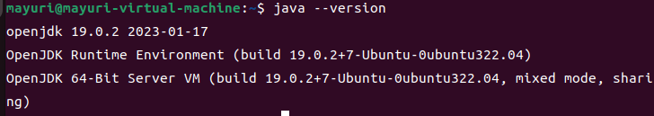

可以看到我的虚拟机上是openjdk 19.0.2，与讲义中推荐的OpenJDK 1.8.0\_41 RI Binaries不同，为了实验不出现意外，我选择安装讲义中推荐的版本。

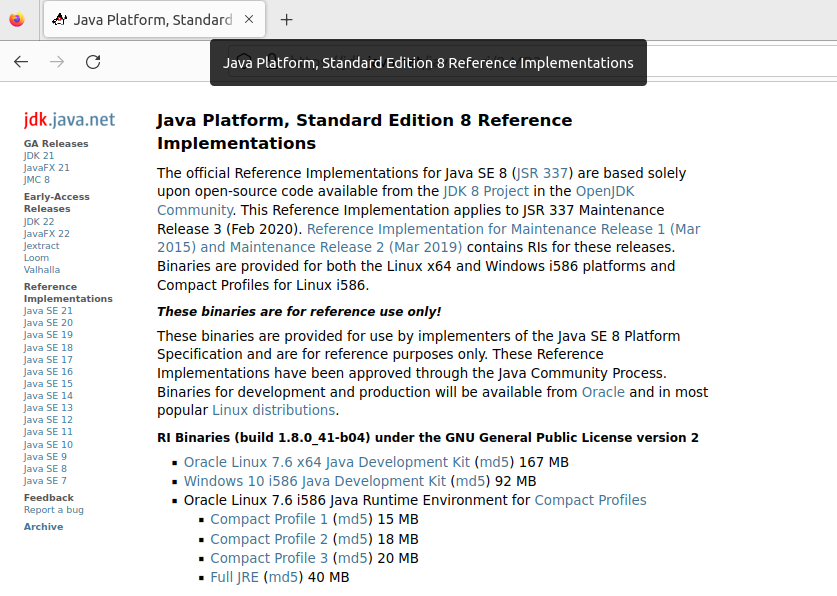

下载167MB大小的那个即可。

之后就是通过tar命令将压缩包解压缩到/usr/lib/jvm之下。

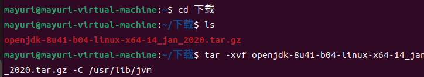

喜闻乐见地出现了许多报错：

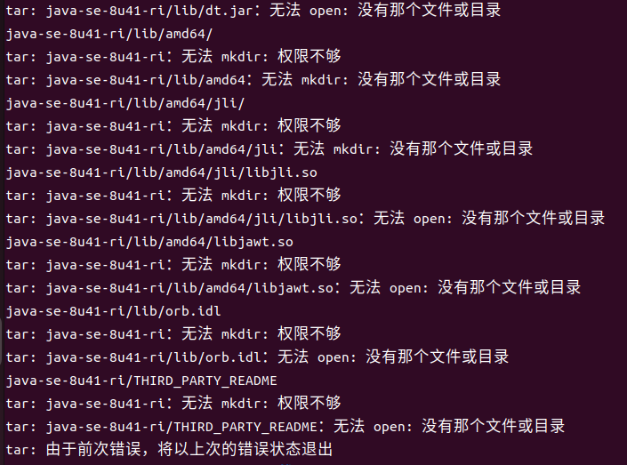

于是我在命令前加上了sudo，成功解压缩：

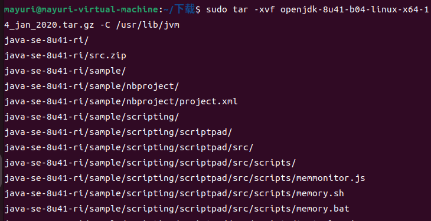

接下来就是修改环境变量了，通过`vim ~/.bashrc`,添加下面的内容：

```plain text
export JAVA_HOME=/usr/lib/jvm/java-se-8u41-ri
export JRE_HOME=${JAVA_HOME}/jre
export CLASSPATH=.:${JAVA_HOME}/lib:${JRE_HOME}/lib
export PATH=${JAVA_HOME}/bin:$PATH
```

再用`source ~/.bashrc`可以使得环境立刻生效。

接着使用`udo update-alternatives --install /usr/bin/java java /usr/lib/jvm/java-se-8u41-ri/bin/java 300`向系统注册新安装的jdk。

现在虚拟机上有了多个jdk，我们要切换到讲义中推荐的版本，可以使用`sudo update-alternatives --config java`命令。

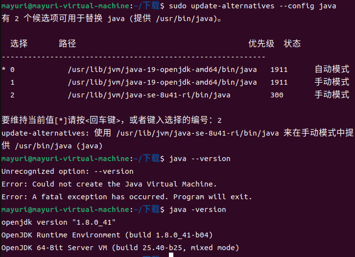

可以看到切换成功（忽略我一个杠打成两个杠的失误）。

接下来就是安装specjvm2008了，进入官网，点击下方图中的蓝色框开始下载。

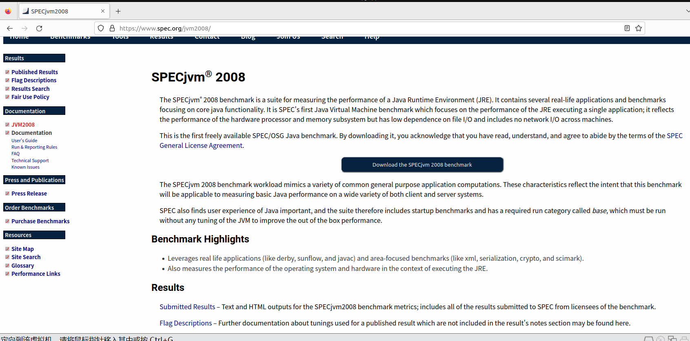

下载完之后，我们在终端中cd到jar包所在目录，并输入`java -jar SPECjvm2008_1_01_setup.jar -i console` 即可。之后就是经典的一路enter，只不过安装路径需要自己指定。

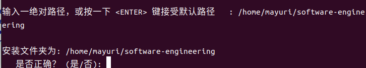

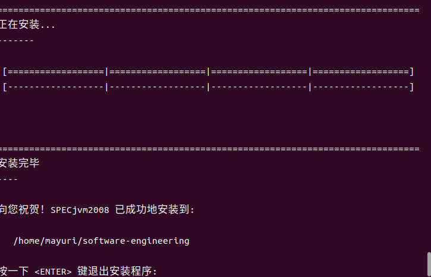

根据userguide中的内容，cd到对应文件夹中，通过`/run-specjvm.sh startup.helloworld -ikv`来检查安装是否成功。

```Plain Text
SPECjvm2008 Base
  Properties file:   none
  Benchmarks:        startup.helloworld

  WARNING: Run will not be compliant.
  Not a compliant sequence of benchmarks for publication.
  Property specjvm.run.checksum.validation must be true for publication.


--- --- --- --- --- --- --- --- ---

  Benchmark:   check
  Run mode:    static run
  Test type:   functional
  Threads:     1
  Iterations:  1
  Run length:  1 operation

Iteration 1 (1 operation) begins: Sat Oct 07 13:20:59 CST 2023
Iteration 1 (1 operation) ends:   Sat Oct 07 13:20:59 CST 2023
Iteration 1 (1 operation) result: PASSED

Valid run!


--- --- --- --- --- --- --- --- ---

  Benchmark:   startup.helloworld
  Run mode:    static run
  Test type:   single
  Threads:     1
  Iterations:  1
  Run length:  1 operation

Iteration 1 (1 operation) begins: Sat Oct 07 13:20:59 CST 2023
Iteration 1 (1 operation) ends:   Sat Oct 07 13:20:59 CST 2023
Iteration 1 (1 operation) result: 250.00 ops/m

Valid run!
Score on startup.helloworld: 250.00 ops/m

Results are stored in: 
/home/mayuri/software-engineering/results/SPECjvm2008.001/SPECjvm2008.001.raw
Generating reports in:
/home/mayuri/software-engineering/results/SPECjvm2008.001

Noncompliant composite result: 250 ops/m
```

可以看到一切正常。

接下来就可以开始跑了，讲义中要求我们只需运行 Base 类别，无需运行 Peak 类别，所以在终端中输入`java -jar SPECjvm2008.jar --base`。

运行了一会后，发现卡住了：

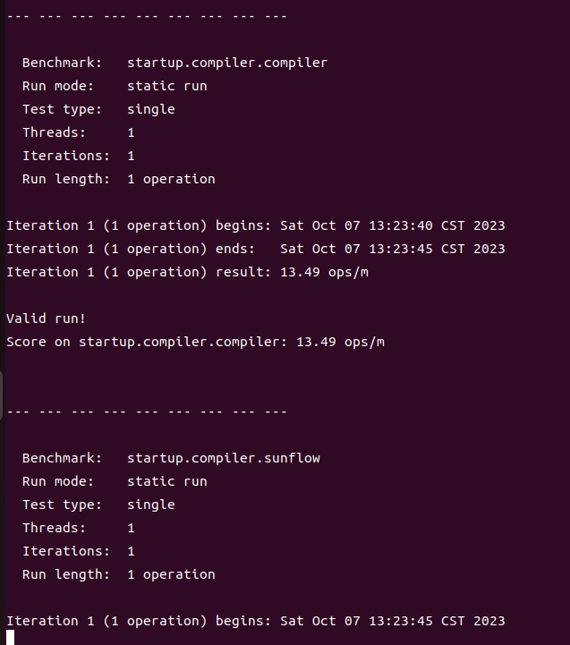

在讲义中给出的[SPECjvm2008 Frequently Asked Questions](https://www.spec.org/jvm2008/docs/FAQ.html)中，我们可以找到原因：

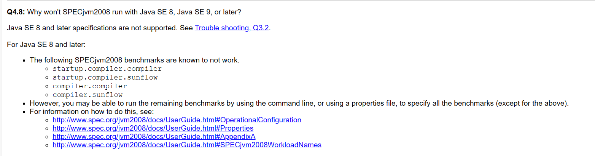

也就是说，在Java SE 8以及之后的版本中：

*   startup.compiler.compiler
*   startup.compiler.sunflow
*   compiler.compiler
*   compiler.sunflow

这四个已经不能够再运行，只能运行其他的。

解决方法就是创建一个properties文件，将这四个全部去掉。

参照props/specjvm.properties的格式，自己创建props/a2.properties:

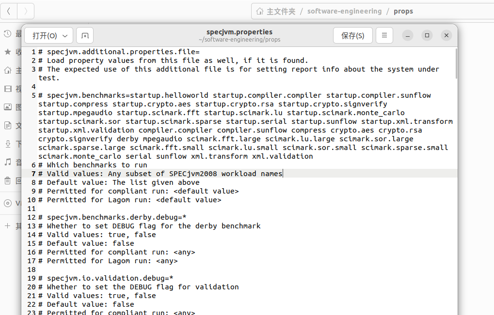

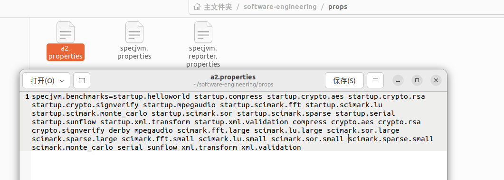

别忘了，这样run的时候就需要指定配置文件了：

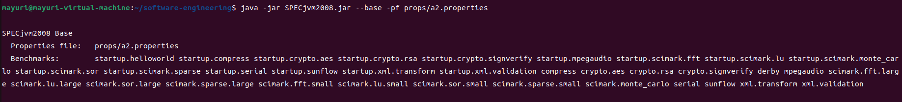

可以看到，properties和benchmarks都和我们的预期一致。

大概跑了大概两个小时吧，cd到results，再从中选择我们所要的报告，打开html文件，可以看到：

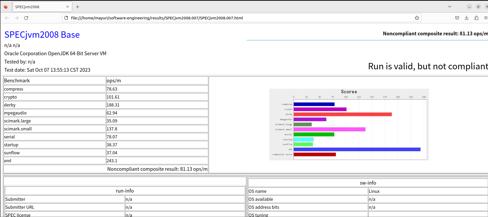

## 3

**查阅过去官方发布结果，对比最近任意一次发布结果（可从表格中任选一项）与自己执行结果的差异，并尝试解释原因。**

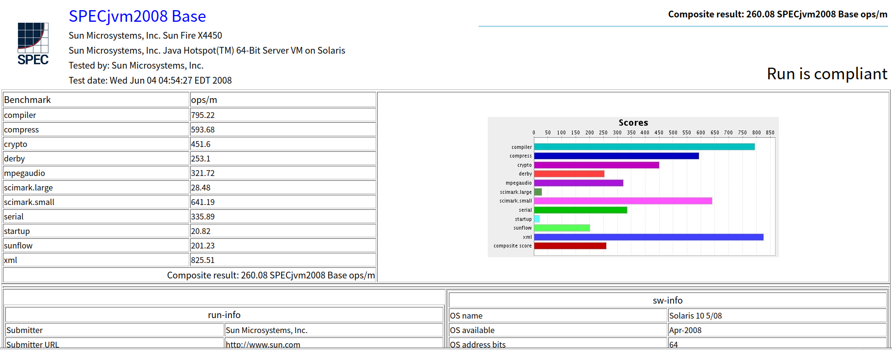

### 第一个不同点

一个最直观的不同点就是官方结果右上角是run is compliant，而我的报告是run is valid， but not compliant。原因就是我去掉了四个benchmark。

### 第二个不同点

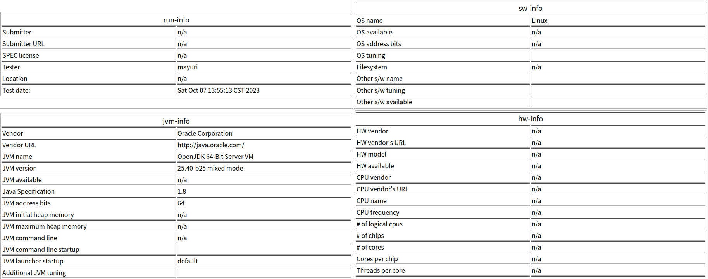

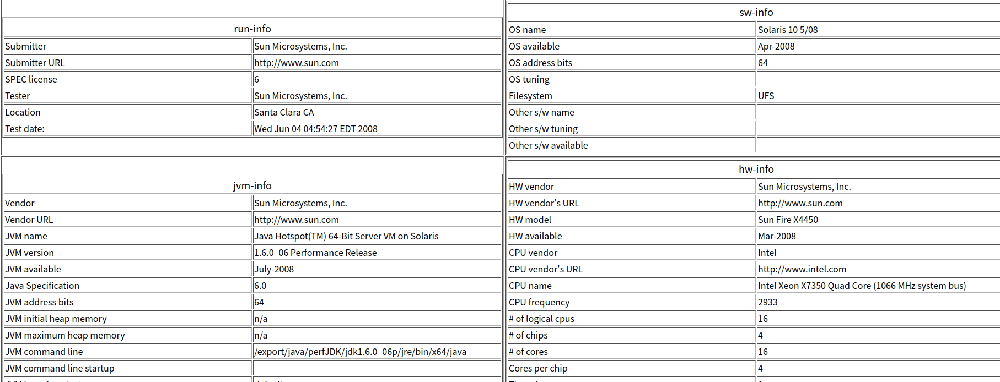

可以看到，我的报告中，设备信息是根本没有显示的。那么如何才能在报告中显示设备信息呢？

我们看向userguide：

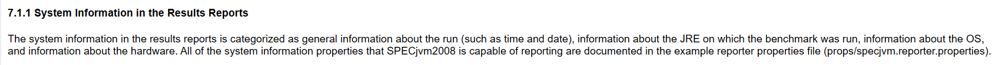

所以，问题就出在我的properties中仅仅指定了benchmark。而要想显示设备信息的话，properties又该怎么写呢？我们只要去props/specjvm.reporter.properties寻找即可：

```Plain Text
# # # # # # # # # # # # #
#
# Information about the hardware system
#
# # # # #  # # #

# Company which sells the hardware
spec.jvm2008.report.hw.vendor=HW_VENDOR

# Home page for company that sells the hardware
spec.jvm2008.report.hw.vendor.url=HW_VENDOR_URL

# What type of system was used when testing
spec.jvm2008.report.hw.model=HW_MODEL

# Date when the hardware product is shipping and
# generally available to the public
spec.jvm2008.report.hw.available=HW_AVAILABLE

# Name of the processor vendor
spec.jvm2008.report.hw.cpu.vendor=HW_CPU_VENDOR

# URL to the processor vendor
spec.jvm2008.report.hw.cpu.vendor.url=HW_CPU_VENDOR_URL

# Product name of the processor(s)
spec.jvm2008.report.hw.cpu.name=HW_CPU_NAME

# MegaHertz rating of the chip. Usually an integer
spec.jvm2008.report.hw.cpu.speed=HW_CPU_SPEED
```

### 第三个不同

至于具体benchmark上的性能差异，那自然有极大的不同。

首先是在一些benchmark上，我和官方结果中从warmup到iter1的变化趋势是不一样的。比如说，mpegaudio：

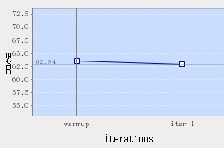

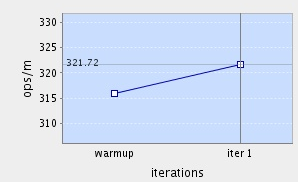

我们可以在[https://www.spec.org/jvm2008/docs/](https://www.spec.org/jvm2008/docs/找到对于) 中找到对不同的benchmark的详细解释。mpegaudio进行的是MP3 解码工作，其中包括大量的浮点数运算。但我并没有思考出这和趋势的不一致之间的联系。

接着是在那些以startup开头的benchmark上，我的结果和官方的结果不会有那种很夸张的很大的差异，而在不以startup开头的benchmark上就经常会出现很恐怖的差异。比如说，compress:

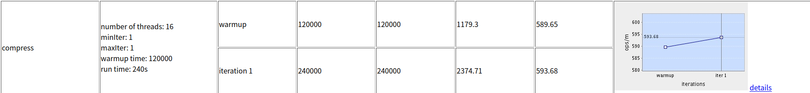

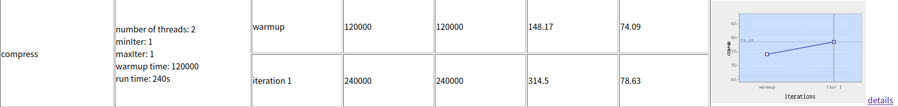

startup是如下的意思:

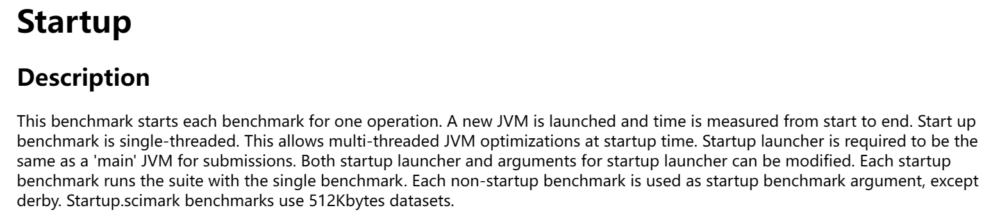

也就是说以startup开头的都是单次处理，而不以startup开头的都是多线程测试。既然知道了这个，那么原因就应该能想到了。对，就是CPU核数。官方的summary report中：

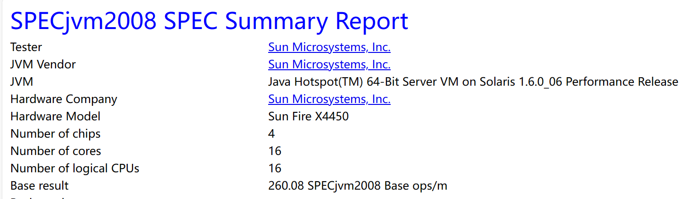

物理CPU有4个，而每个CPU有16个核。然而用上个实验学到的lscpu，我发现自己的物理CPU只有2个，每个CPU只有1个核心，可以说是相当惨淡。那这样的结果就是比较合理的了。

## 4

**谈谈自己运行一次标准的基准评测的感想和体会。**

感受到了读官方文档的重要性。与其遇到问题去搜索引擎上找其他人写的博客，不如好好地读官方文档，很多问题都在里面有解释。当然，英语阅读水平和耐心都要好，不然看着一屏幕的英文可能感到天旋地转。还有就是一次标准的基准评测耗时真的蛮长的，我估计大概有两个多小时，这时候就不能忙等，果断去写其他作业，等到跑完再继续写实验报告。

这次实验中我熟悉了specjvm2008的安装，环境的配置以及基准测试的工作流程。并且通过阅读文档找到了benchmark卡住的问题所在，最后还分析了官方发布结果和我本人跑出来的结果之间的区别，收获还是很丰富的。