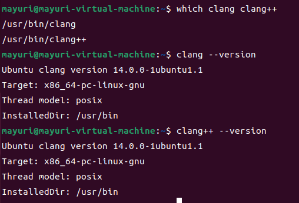

A3
==

gcc和clang的版本与路径检查
-----------------




### wirte-up 1

通过之前用which查到的存放路径，用ls -l查看具体信息：


可以发现/usr/bin/clang和/usr/bin/clang++都是软链接，分别指向/lib/llvm-14/bin/clang和/lib/llvm-14/bin/clang++。

然后我们如法炮制：


可以发现/lib/llvm-14/bin/clang++还是一个软链接，指向同目录下面的clang。

所以clang --version和clang++ --version的结果是一样的。

安装性能测试集
-------


**编译器及优化选项的组合测试**
-----------------

### write-up 2

我选择了loop\_unroll。因为老师在lecture6源程序级别的常见优化方法中专门提到了循环展开的优化方法。它不是仅有优点，它还有着会让代码变长和影响code cache的缺点。这已经可以预见的有分析的价值了。而且，对于循环的处理我觉得也肯定是编译器优化的重要阵地，所以我选择了loop\_unroll。

write-up 3
----------

我在BINARIES中只保留了loop\_unroll并且注释掉了其余的所有测试用例。


同时，我也修改了report中的相关信息，使得最终的report\_file只保留有关loop\_unroll的信息。


注意，最后输出时间和版本的不能注释掉：


打开loop\_unroll.cpp：


可以发现这个循环次数有点恐怖了，400000，我估计得等好久好久。我估摸着去掉了两个0，改成了4000。事后的经验来看，改成更短的循环次数也可以，那样需要等待的时间就更少。但是改成4000后的时间是完全可以接受的，为了实验结果的准确性性我最终选取了4000。

我本来以为修改完上面的我就可以做接下来的任务了，但是并不是。在我按照讲义中的要求，make clean之后make report CC=clang CXX=clang++ OPTLEVEL=-O1的时候，我发现了一个奇怪的现象：


我明明在命令行中指定了优化等级是O1，为什么执行的是O3？

再仔细看看makefile:


好家伙，我们在命令行中指定的OPTLEVEL根本没有派上用场，直接默认了-O3。也就是说，我们要对这个makefile进行一些修改：


这样就可以根据命令行来指定优化水平了。

**测试数据的分析**
-----------

### writeup-4


可以发现，无论在O0、O1还是O2之下，gcc编译产生的loop\_unroll文件的大小都是差不多的。而对于clang来说，从O0到O1，loop\_unroll文件大小直接扩大了将近两倍，O2在O1的基础上还要大一些。


我拿unit8\_t的测试结果进行分析，因为其他的结果的趋势是差不多的。

clang-O0、clang-O1和clang-O2:

```Plain Text
Total absolute time for uint8_t for loop unrolling: 13.37 sec
Total absolute time for uint8_t do loop unrolling: 0.24 sec
Total absolute time for uint8_t for loop unrolling: 0.24 sec
```

可以看到从O0到O1的运行时间显著减小，但是从O1到O2就基本没什么变化。结合前面关于文件大小的图，可以发现随着O0到O1运行时间的降低，代码体积迅速膨胀，我感觉原因就是clang在O1的时候便开启了循环展开。

但是我查了很久都没有查到clang在不同的优化水平下开了哪些具体的优化，只找到：


所以我推测clang在O1和O2的时候肯定开启了-funcroll-loops和-fno-unroll-loops。

再看看gcc-O0、gcc-O1和gcc-O2:

```Plain Text
Total absolute time for uint8_t for loop unrolling: 13.12 sec
Total absolute time for uint8_t for loop unrolling: 1.54 sec
Total absolute time for uint8_t for loop unrolling: 0.70 sec
```

可以看到从O0到O1再到O2，每一次优化水平的提高都是会有显著的运行时间缩短的，即使从O1到O2没有从O0到O1那么显著。但是结合之前文件大小的图表，不同的优化水平下代码的体积并没有明显的膨胀现象。

查阅gcc的文档：


可以发现，gcc直到O3才进行了循环展开的优化，这解释了为什么gcc不像clang那样出现了代码体积的爆炸性增长，运行时间的缩短并不是靠着循环展开。

gcc的结果是要略慢于clang的，原因可能正是没有开启循环展开，但是它胜在代码体积。

总结
--

通过循环展开，程序不必再判断循环遍历，减少了分支预测错误的次数，从而提高了性能。但是循环展开也导致了代码可读性的降低和code cache的问题。

一定要记得查看**编译器相应版本**的文档。我一开始查看的gcc文档的版本过于老旧，导致我无法查询到自己需要的信息，白白在电脑前抓耳挠腮。不过可惜的是在clang对应版本的文档中，我并没有找到自己需要的信息。

在每次测试前记得一定要make clean，不然你在后续的测试中获得的数据始终都是基于最开始的那次测试的。