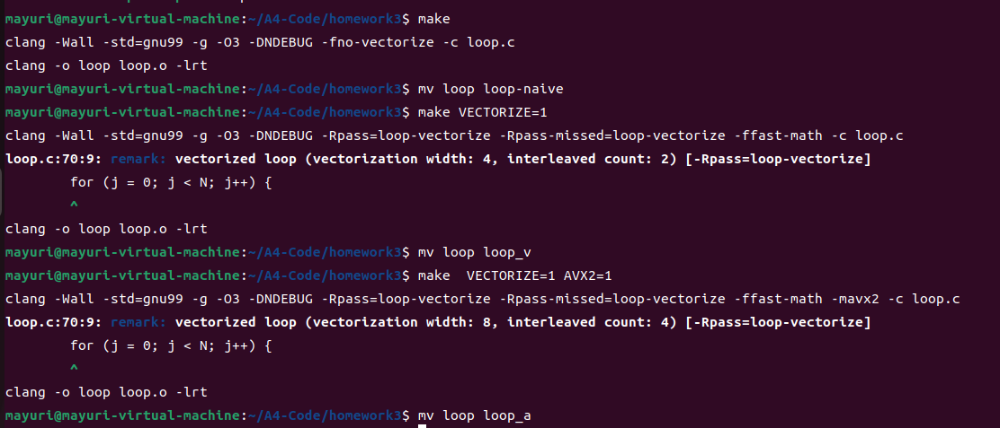

A4
==

1
-

**请同学们对照着 example1.c 仔细理解上一命令的输出文件 example1.s，画出汇编代码的控制流图。同时比较一下你得到的 example1.s 跟下图中另一版本的编译器生成的 example1.s 有什么区别。详细说明你得到的 example1.s 中.LBB0\_2 内向量化后代码的循环控制逻辑跟下图中.LBB0\_2 内向量化后代码的循环控制逻辑有何不同，阐述你对这两种代码生成方法各自优缺点的理解。**


### 背景知识

由于该任务需要我们阅读汇编代码，所以我们是必须要了解一些基础的汇编知识的。而这部分内容在计算机系统中已经学习过了，只不过时间太长，我已经有点遗忘了。为了完成本次实验，我复习了下相关知识。我将本write-up所需要的知识列在下方：


在csapp的p168中有一张图展示了传递函数参数的寄存器，这告诉了我们example1.c中a和b被放在了哪两个寄存器当中。当然，example1.s中的:

```asm
#DEBUG_VALUE: test:a <- $rdi
#DEBUG_VALUE: test:b <- $rsi
#DEBUG_VALUE: test:i <- 0
```

也告诉了我们，不过记住这些知识也是好的啦。


p135页的条件码的知识，后面有一个比较的地方会用到：


### clang版本


### 汇编代码的控制流图


因为我上面所画的控制流图把细节全部去掉了，只保留了最基本的控制语句，所以我接下来我就结合上面的图，详细解释下example1.s到底做了些什么。

可以看到，用菱形表示的是判断条件，我们先将注意力转向从上到下的头两个菱形框。它们分别判断了b+SIZE与a的大小和a+SIZE与b的大小。这两个判断非常关键，它们是用来确定后续的循环是否能够**向量化**的。我们回忆下助教在上周三的课程中所教的内容：只有当数组之间不存在overlap的情况的时候才能应用overlap。这里的两个判断就是起到了这个作用。如果b+SIZE<=a，说明a和b之间不存在重叠，b的整个数组都在a的前面。而也不能完全摒弃b+SIZE>a的情况，因为它里面包含着a的整个数组在b的前面的情况，而这种情况是可以向量化的。第二个判断正是为了区分出这种情况。

经过上述的分析，我们就能知道，第二个菱形框之后的左分支代表能够向量化的情况，而右分支代表不能向量化的情况。先来说一下向量化具体是怎么做的。使用向量化后的循环中，每次i都加上了64。每轮循环之都对64个字节的数据进行了操作，而且是16个字节1组分成4组进行a\[i\]+=b\[i\]的操作的。而在右分支中，每次i都仅仅加了4。每轮循环中都分别对i,i+1,i+2,i+3这三个位置进行a\[i\]+=b\[i\]的操作。

### 比较不同

两份汇编代码在判断是否存在overlap的情况上是一致的。但是，当进入向量化分支或者非向量化分支后，差异就开始显现了。最开始映入眼帘的是循环变量初始化的不同。

向量化分支循环变量的初始化：


非向量化分支循环变量的初始化：


可以看到，讲义中给出的代码初始化循环变量为-65536，而我的代码中初始化循环变量为0。这种初始化的不同导致的结果就是：


**由于讲义中代码对此的处理在向量化和非向量化中都是一样的，我这里只拿向量化举个例子。**

讲义中的代码在.Ltmp0的每轮循环中需要用到循环变量的地方都给循环变量加上了65536，因为-65536+65536就等于0嘛，抵消掉了。抛开这点，循环内的总体逻辑还是与我对example1.s的分析中是一样的。

还有一个相应的结果就是循环终止条件的不同：


可以看到，在讲义所给的代码中不需要cmpq与65536进行比较。因为初始化时候的值为-65536，所以判断循环是否应该终止的时候应该与0进行比较。而又因为状态位寄存器的存在，在addq后可以自动判断是否为0，也就不需要cmpq了。

### 优缺点

很明显，讲义中代码每轮循环都不再需要cmpq，而cmpq是通过作差来进行比较的。也就是说，讲义中代码在每轮循环中要比我的代码少进行一次减法操作。但是，作为代价，每次需要访问内存计算偏移的时候都需要加上一个65536。不过，这个数本来就是要加的，区别只是在于要加的数具体是多少而已。举个例子，就是这条指令：`movdqu 16(%rsi,%rax), %xmm1`中的16变成65552。但是，观察这条指令`movdqu (%rsi,%rax), %xmm0`，它变成了`movdqu 65536(%rsi,%rax), %xmm0`，需要多执行一次加法了。`movdqu (%rdi,%rax), %xmm2`是同样的道理。也就是说，讲义中的代码每轮循环少进行一次减法操作，但是多进行了两次加法操作。计算机中减法是通过加法实现的，两者的性能是差不多的。所以我就姑且认为两次加法需要的时间要大于一次减法需要的时间。不过即使是大于，应该也大不到哪里去。所以其实两份代码的效率是差不多的。既然效率差不多了，接下来就是可读性的问题了。显然，在这个方面，我的代码完胜，因为它就是根据源代码的逻辑来的。

2
-

**请同学们仔细理解这个命令所产生的新的输出文件 example1.s 与 Write-up 1中所分析的 example1.s 有何区别，简单阐述为何会有这个区别。**


执行完这个命令后，我很悲催地发现原来的example1.s被覆盖掉了。万幸之前的内容在实验报告中有记录，在做之后的write-up的时候最好重命名下文件。

新的example1.s中的主要内容:

```asm
	.text
	.file	"example1.c"
	.globl	test                            # -- Begin function test
	.p2align	4, 0x90
	.type	test,@function
test:                                   # @test
.Lfunc_begin0:
	.file	0 "/home/mayuri/A4-Code/recitation3" "example1.c" md5 0x094e920f5f12746d7cc7ddf73cde262d
	.loc	0 9 0                           # example1.c:9:0
	.cfi_startproc
# %bb.0:
	#DEBUG_VALUE: test:a <- $rdi
	#DEBUG_VALUE: test:b <- $rsi
	xorl	%eax, %eax
.Ltmp0:
	#DEBUG_VALUE: test:i <- 0
	.p2align	4, 0x90
.LBB0_1:                                # =>This Inner Loop Header: Depth=1
	#DEBUG_VALUE: test:a <- $rdi
	#DEBUG_VALUE: test:b <- $rsi
	#DEBUG_VALUE: test:i <- 0
	.loc	0 13 13 prologue_end            # example1.c:13:13
	movdqu	(%rsi,%rax), %xmm0
	movdqu	16(%rsi,%rax), %xmm1
	.loc	0 13 10 is_stmt 0               # example1.c:13:10
	movdqu	(%rdi,%rax), %xmm2
	paddb	%xmm0, %xmm2
	movdqu	16(%rdi,%rax), %xmm0
	paddb	%xmm1, %xmm0
	movdqu	32(%rdi,%rax), %xmm1
	movdqu	48(%rdi,%rax), %xmm3
	movdqu	%xmm2, (%rdi,%rax)
	movdqu	%xmm0, 16(%rdi,%rax)
	.loc	0 13 13                         # example1.c:13:13
	movdqu	32(%rsi,%rax), %xmm0
	.loc	0 13 10                         # example1.c:13:10
	paddb	%xmm1, %xmm0
	.loc	0 13 13                         # example1.c:13:13
	movdqu	48(%rsi,%rax), %xmm1
	.loc	0 13 10                         # example1.c:13:10
	paddb	%xmm3, %xmm1
	movdqu	%xmm0, 32(%rdi,%rax)
	movdqu	%xmm1, 48(%rdi,%rax)
.Ltmp1:
	.loc	0 12 26 is_stmt 1               # example1.c:12:26
	addq	$64, %rax
	cmpq	$65536, %rax                    # imm = 0x10000
	jne	.LBB0_1
.Ltmp2:
# %bb.2:
	#DEBUG_VALUE: test:a <- $rdi
	#DEBUG_VALUE: test:b <- $rsi
	#DEBUG_VALUE: test:i <- 0
	.loc	0 15 1                          # example1.c:15:1
	retq
```

我们可以发现，原先的非向量化分支直接就被去掉了！只剩下了向量化分支。看来这就是restrict的作用了，那么restrict关键词到底有什么用呢？它的主要作用就是告诉编译器，这个指针是访问数据的唯一途径，其他指针不能同时指向相同的数据。也就是说，只要加上了restrict关键词，编译器就会认为不可能存在overlap的情况，因此也自然就会采取向量化优化。

3
-

**请同学们仔细理解这个命令所产生的新的输出文件 example1.s 与 Write-up 2中所分析的 example1.s 有何区别，简单阐述为何会有这个区别**

先通过下述命令将write-up2中的文件重命名：

```shellscript
mv example1.s example1_2.s
```


example1.s中的部分内容:

```asm
        .text
	.file	"example1.c"
	.globl	test                            # -- Begin function test
	.p2align	4, 0x90
	.type	test,@function
test:                                   # @test
.Lfunc_begin0:
	.file	0 "/home/mayuri/A4-Code/recitation3" "example1.c" md5 0x6228f29dde5fb8fac79f77f7348bfec1
	.loc	0 9 0                           # example1.c:9:0
	.cfi_startproc
# %bb.0:
	#DEBUG_VALUE: test:a <- $rdi
	#DEBUG_VALUE: test:b <- $rsi
	xorl	%eax, %eax
.Ltmp0:
	#DEBUG_VALUE: test:i <- 0
	.p2align	4, 0x90
.LBB0_1:                                # =>This Inner Loop Header: Depth=1
	#DEBUG_VALUE: test:a <- $rdi
	#DEBUG_VALUE: test:b <- $rsi
	#DEBUG_VALUE: test:i <- 0
	.loc	0 16 10 prologue_end            # example1.c:16:10
	movdqa	(%rdi,%rax), %xmm0
	movdqa	16(%rdi,%rax), %xmm1
	movdqa	32(%rdi,%rax), %xmm2
	movdqa	48(%rdi,%rax), %xmm3
	paddb	(%rsi,%rax), %xmm0
	paddb	16(%rsi,%rax), %xmm1
	movdqa	%xmm0, (%rdi,%rax)
	movdqa	%xmm1, 16(%rdi,%rax)
	paddb	32(%rsi,%rax), %xmm2
	paddb	48(%rsi,%rax), %xmm3
	movdqa	%xmm2, 32(%rdi,%rax)
	movdqa	%xmm3, 48(%rdi,%rax)
.Ltmp1:
	.loc	0 15 26                         # example1.c:15:26
	addq	$64, %rax
	cmpq	$65536, %rax                    # imm = 0x10000
	jne	.LBB0_1
.Ltmp2:
# %bb.2:
	#DEBUG_VALUE: test:a <- $rdi
	#DEBUG_VALUE: test:b <- $rsi
	#DEBUG_VALUE: test:i <- 0
	.loc	0 18 1                          # example1.c:18:1
	retq
```

\_\_builtin\_assume\_aligned的作用是告诉编译器一个指针已经对齐了，而第二个参数则指定了具体是按照多少字节对齐。

一个很明显的不同就是，原先的movdqu都变成了movdqa。我参考了：

[MOVDQA: Move Aligned Double Quadword (x86 Instruction Set Reference) (mudongliang.github.io)](https://mudongliang.github.io/x86/html/file_module_x86_id_183.html)


[MOVDQU: Move Unaligned Double Quadword (x86 Instruction Set Reference) (c9x.me)](https://c9x.me/x86/html/file_module_x86_id_184.html)


简单的概括来说，movdqu用于移动非对齐的双四字，而movdqa用于移动对齐的双四字，这个对齐指的是16字节对齐。可以看到我们\_\_builtin\_assume\_aligned中的第二个参数正是16，所以可以用movdqa来代替movdqu。但是究竟为什么要进行这样的替换呢？我从[Perf regression: MOVDQU instructions are generated when 16-byte aligned loads are requested - Developer Community (visualstudio.com)](https://developercommunity.visualstudio.com/t/perf-regression-movdqu-instructions-are-generated/48123)中找到了答案，这个链接中引用了一个pdf:[https://www.agner.org/optimize/instruction\_tables.pdf](https://www.agner.org/optimize/instruction_tables.pdf.) 。

我们可以看到，在一些比较老的CPU上，用movdqu来load需要4个微操作，而用movdqu来store需要9个微操作，性能是很差的。不过在最新的CPU两者的性能差异已经不大了。

还有一个不同点就是新的汇编代码明显要比原来的汇编代码更加紧凑。仔细阅读下两份汇编代码，我发现两份代码中循环的具体处理方式改变了：

*   原来的汇编代码中是同时将a数组和b数组全部load到寄存器中，再进行相加，最后将结果写回到a数组
*   新的汇编代码是先将a数组内元素load到寄存器当中，再直接将a数组元素与b数组元素相加，最后将结果写回到a数组

可以看到新的汇编代码省去了很多寄存器load的操作，性能表现上会更加好。

之所以会产生这样的变化，就是因为\_\_builtin\_assume\_aligned的存在，编译器通过我们的信息，知道了a和b两个指针都是对齐的。编译器这下就立刻明白自己只要去取数组内的数据就一定可以取到，而不需要担心出现page fault的问题。

4
-

**请同学们仔细理解这个命令所产生的新的输出文件 example1.s 与 Write-up 3中所分析的 example1.s 有何区别，简单阐述为何会有这个区别。为使编译器生成对齐内存访问的 AVX2 指令，应该对 example1.c 再做何修改？请附上修改后的代码。**


先通过下述命令将write-up3中的文件重命名：

```shellscript
mv example1.s example1_3.s
```

部分关键代码：

```asm
        .text
	.file	"example1.c"
	.globl	test                            # -- Begin function test
	.p2align	4, 0x90
	.type	test,@function
test:                                   # @test
.Lfunc_begin0:
	.file	0 "/home/mayuri/A4-Code/recitation3" "example1.c" md5 0x6228f29dde5fb8fac79f77f7348bfec1
	.loc	0 9 0                           # example1.c:9:0
	.cfi_startproc
# %bb.0:
	#DEBUG_VALUE: test:a <- $rdi
	#DEBUG_VALUE: test:b <- $rsi
	xorl	%eax, %eax
.Ltmp0:
	#DEBUG_VALUE: test:i <- 0
	.p2align	4, 0x90
.LBB0_1:                                # =>This Inner Loop Header: Depth=1
	#DEBUG_VALUE: test:a <- $rdi
	#DEBUG_VALUE: test:b <- $rsi
	#DEBUG_VALUE: test:i <- 0
	.loc	0 16 10 prologue_end            # example1.c:16:10
	vmovdqu	(%rdi,%rax), %ymm0
	vmovdqu	32(%rdi,%rax), %ymm1
	vmovdqu	64(%rdi,%rax), %ymm2
	vmovdqu	96(%rdi,%rax), %ymm3
	vpaddb	(%rsi,%rax), %ymm0, %ymm0
	vpaddb	32(%rsi,%rax), %ymm1, %ymm1
	vpaddb	64(%rsi,%rax), %ymm2, %ymm2
	vpaddb	96(%rsi,%rax), %ymm3, %ymm3
	vmovdqu	%ymm0, (%rdi,%rax)
	vmovdqu	%ymm1, 32(%rdi,%rax)
	vmovdqu	%ymm2, 64(%rdi,%rax)
	vmovdqu	%ymm3, 96(%rdi,%rax)
.Ltmp1:
	.loc	0 15 26                         # example1.c:15:26
	subq	$-128, %rax
	cmpq	$65536, %rax                    # imm = 0x10000
	jne	.LBB0_1
.Ltmp2:
# %bb.2:
	#DEBUG_VALUE: test:a <- $rdi
	#DEBUG_VALUE: test:b <- $rsi
	#DEBUG_VALUE: test:i <- 0
	.loc	0 18 1                          # example1.c:18:1
	vzeroupper
	retq
```

可以发现，原来的movdqa都变成了vmovdqu。这里具体有两个变化：

*   mov前面新增加的v表明该指令是一个向量化指令。
*   从movdqa重新变回了movdqu，表明代码中的a和b数组并没有根据要求进行对齐。

还有一个变化就是从128位的xmm变成了256位的ymm。这是很自然的，毕竟我们开启了AVX2。

为使编译器生成对齐内存访问的 AVX2 指令，我们应该将16字节对齐更新为32字节对齐：


新的代码：

```asm
        .text
	.file	"example1.c"
	.globl	test                            # -- Begin function test
	.p2align	4, 0x90
	.type	test,@function
test:                                   # @test
.Lfunc_begin0:
	.file	0 "/home/mayuri/A4-Code/recitation3" "example1.c" md5 0xf0669bb999ec5751bd450068da5dbc50
	.loc	0 9 0                           # example1.c:9:0
	.cfi_startproc
# %bb.0:
	#DEBUG_VALUE: test:a <- $rdi
	#DEBUG_VALUE: test:b <- $rsi
	xorl	%eax, %eax
.Ltmp0:
	#DEBUG_VALUE: test:i <- 0
	.p2align	4, 0x90
.LBB0_1:                                # =>This Inner Loop Header: Depth=1
	#DEBUG_VALUE: test:a <- $rdi
	#DEBUG_VALUE: test:b <- $rsi
	#DEBUG_VALUE: test:i <- 0
	.loc	0 16 10 prologue_end            # example1.c:16:10
	vmovdqa	(%rdi,%rax), %ymm0
	vmovdqa	32(%rdi,%rax), %ymm1
	vmovdqa	64(%rdi,%rax), %ymm2
	vmovdqa	96(%rdi,%rax), %ymm3
	vpaddb	(%rsi,%rax), %ymm0, %ymm0
	vpaddb	32(%rsi,%rax), %ymm1, %ymm1
	vpaddb	64(%rsi,%rax), %ymm2, %ymm2
	vpaddb	96(%rsi,%rax), %ymm3, %ymm3
	vmovdqa	%ymm0, (%rdi,%rax)
	vmovdqa	%ymm1, 32(%rdi,%rax)
	vmovdqa	%ymm2, 64(%rdi,%rax)
	vmovdqa	%ymm3, 96(%rdi,%rax)
.Ltmp1:
	.loc	0 15 26                         # example1.c:15:26
	subq	$-128, %rax
	cmpq	$65536, %rax                    # imm = 0x10000
	jne	.LBB0_1
.Ltmp2:
# %bb.2:
	#DEBUG_VALUE: test:a <- $rdi
	#DEBUG_VALUE: test:b <- $rsi
	#DEBUG_VALUE: test:i <- 0
	.loc	0 18 1                          # example1.c:18:1
	vzeroupper
	retq
```

可以看到全部都是vmovdqa了。

5
-

**请认真比较 example2.s 和 example2.s.ORG，尝试解释一下为什么新examplse2.s 含有比较高效的向量化代码。**


example2.s中部分内容：

```asm
	.text
	.file	"example2.c"
	.globl	test                            # -- Begin function test
	.p2align	4, 0x90
	.type	test,@function
test:                                   # @test
.Lfunc_begin0:
	.file	0 "/home/mayuri/A4-Code/recitation3" "example2.c" md5 0x00ae277273f921de286fabd5c8f5de6b
	.loc	0 9 0                           # example2.c:9:0
	.cfi_startproc
# %bb.0:
	#DEBUG_VALUE: test:a <- $rdi
	#DEBUG_VALUE: test:b <- $rsi
	#DEBUG_VALUE: test:x <- $rdi
	#DEBUG_VALUE: test:y <- $rsi
	xorl	%eax, %eax
.Ltmp0:
	#DEBUG_VALUE: test:i <- 0
	.p2align	4, 0x90
.LBB0_1:                                # =>This Inner Loop Header: Depth=1
	#DEBUG_VALUE: test:a <- $rdi
	#DEBUG_VALUE: test:b <- $rsi
	#DEBUG_VALUE: test:x <- $rdi
	#DEBUG_VALUE: test:y <- $rsi
	#DEBUG_VALUE: test:i <- 0
	.loc	0 18 13 prologue_end            # example2.c:18:13
	movdqa	(%rsi,%rax), %xmm0
	movdqa	16(%rsi,%rax), %xmm1
	.loc	0 18 12 is_stmt 0               # example2.c:18:12
	pmaxub	(%rdi,%rax), %xmm0
	pmaxub	16(%rdi,%rax), %xmm1
	.loc	0 18 10                         # example2.c:18:10
	movdqa	%xmm0, (%rdi,%rax)
	movdqa	%xmm1, 16(%rdi,%rax)
	.loc	0 18 13                         # example2.c:18:13
	movdqa	32(%rsi,%rax), %xmm0
	movdqa	48(%rsi,%rax), %xmm1
	.loc	0 18 12                         # example2.c:18:12
	pmaxub	32(%rdi,%rax), %xmm0
	pmaxub	48(%rdi,%rax), %xmm1
	.loc	0 18 10                         # example2.c:18:10
	movdqa	%xmm0, 32(%rdi,%rax)
	movdqa	%xmm1, 48(%rdi,%rax)
.Ltmp1:
	.loc	0 15 26 is_stmt 1               # example2.c:15:26
	addq	$64, %rax
	cmpq	$65536, %rax                    # imm = 0x10000
	jne	.LBB0_1
.Ltmp2:
# %bb.2:
	#DEBUG_VALUE: test:a <- $rdi
	#DEBUG_VALUE: test:b <- $rsi
	#DEBUG_VALUE: test:x <- $rdi
	#DEBUG_VALUE: test:y <- $rsi
	#DEBUG_VALUE: test:i <- 0
	.loc	0 20 1                          # example2.c:20:1
	retq
```

example2.s.ORG部分内容：

```asm
	.text
	.file	"example2.c"
	.globl	test                            # -- Begin function test
	.p2align	4, 0x90
	.type	test,@function
test:                                   # @test
.Lfunc_begin0:
	.file	0 "/home/mayuri/A4-Code/recitation3" "example2.c" md5 0xae2f0cdd8519a52c6207f08b4cbb782f
	.loc	0 9 0                           # example2.c:9:0
	.cfi_startproc
# %bb.0:
	#DEBUG_VALUE: test:a <- $rdi
	#DEBUG_VALUE: test:b <- $rsi
	#DEBUG_VALUE: test:x <- $rdi
	#DEBUG_VALUE: test:y <- $rsi
	xorl	%eax, %eax
.Ltmp0:
	#DEBUG_VALUE: test:i <- 0
	pcmpeqd	%xmm0, %xmm0
	jmp	.LBB0_1
.Ltmp1:
	.p2align	4, 0x90
.LBB0_17:                               #   in Loop: Header=BB0_1 Depth=1
	#DEBUG_VALUE: test:a <- $rdi
	#DEBUG_VALUE: test:b <- $rsi
	#DEBUG_VALUE: test:x <- $rdi
	#DEBUG_VALUE: test:y <- $rsi
	#DEBUG_VALUE: test:i <- 0
	.loc	0 15 26 prologue_end            # example2.c:15:26
	addq	$8, %rax
	cmpq	$65536, %rax                    # imm = 0x10000
	je	.LBB0_18
.Ltmp2:
.LBB0_1:                                # =>This Inner Loop Header: Depth=1
	#DEBUG_VALUE: test:a <- $rdi
	#DEBUG_VALUE: test:b <- $rsi
	#DEBUG_VALUE: test:x <- $rdi
	#DEBUG_VALUE: test:y <- $rsi
	#DEBUG_VALUE: test:i <- 0
	.loc	0 17 9                          # example2.c:17:9
	movq	(%rsi,%rax), %xmm1              # xmm1 = mem[0],zero
	.loc	0 17 16 is_stmt 0               # example2.c:17:16
	movq	(%rdi,%rax), %xmm3              # xmm3 = mem[0],zero
	.loc	0 17 14                         # example2.c:17:14
	pminub	%xmm1, %xmm3
	pcmpeqb	%xmm1, %xmm3
	movd	%xmm3, %ecx
	notb	%cl
.Ltmp3:
	.loc	0 15 26 is_stmt 1               # example2.c:15:26
	testb	$1, %cl
	je	.LBB0_3
.Ltmp4:
# %bb.2:                                #   in Loop: Header=BB0_1 Depth=1
	#DEBUG_VALUE: test:a <- $rdi
	#DEBUG_VALUE: test:b <- $rsi
	#DEBUG_VALUE: test:x <- $rdi
	#DEBUG_VALUE: test:y <- $rsi
	#DEBUG_VALUE: test:i <- 0
	.loc	0 17 14                         # example2.c:17:14
	movd	%xmm1, %ecx
	movb	%cl, (%rdi,%rax)
.Ltmp5:
.LBB0_3:                                #   in Loop: Header=BB0_1 Depth=1
	#DEBUG_VALUE: test:a <- $rdi
	#DEBUG_VALUE: test:b <- $rsi
	#DEBUG_VALUE: test:x <- $rdi
	#DEBUG_VALUE: test:y <- $rsi
	#DEBUG_VALUE: test:i <- 0
	movdqa	%xmm3, %xmm2
	pxor	%xmm0, %xmm2
	movdqa	%xmm2, %xmm4
	pslld	$8, %xmm4
	movd	%xmm4, %ecx
	shrl	$16, %ecx
	testb	$1, %cl
	je	.LBB0_5
.Ltmp6:
# %bb.4:                                #   in Loop: Header=BB0_1 Depth=1
	#DEBUG_VALUE: test:a <- $rdi
	#DEBUG_VALUE: test:b <- $rsi
	#DEBUG_VALUE: test:x <- $rdi
	#DEBUG_VALUE: test:y <- $rsi
	#DEBUG_VALUE: test:i <- 0
	movd	%xmm1, %ecx
	movb	%ch, 1(%rdi,%rax)
.Ltmp7:
.LBB0_5:                                #   in Loop: Header=BB0_1 Depth=1
	#DEBUG_VALUE: test:a <- $rdi
	#DEBUG_VALUE: test:b <- $rsi
	#DEBUG_VALUE: test:x <- $rdi
	#DEBUG_VALUE: test:y <- $rsi
	#DEBUG_VALUE: test:i <- 0
	pshuflw	$85, %xmm3, %xmm4               # xmm4 = xmm3[1,1,1,1,4,5,6,7]
	pxor	%xmm0, %xmm4
	pextrw	$2, %xmm4, %ecx
	testb	$1, %cl
	je	.LBB0_7
.Ltmp8:
# %bb.6:                                #   in Loop: Header=BB0_1 Depth=1
	#DEBUG_VALUE: test:a <- $rdi
	#DEBUG_VALUE: test:b <- $rsi
	#DEBUG_VALUE: test:x <- $rdi
	#DEBUG_VALUE: test:y <- $rsi
	#DEBUG_VALUE: test:i <- 0
	movd	%xmm1, %ecx
	shrl	$16, %ecx
	movb	%cl, 2(%rdi,%rax)
.Ltmp9:
.LBB0_7:                                #   in Loop: Header=BB0_1 Depth=1
	#DEBUG_VALUE: test:a <- $rdi
	#DEBUG_VALUE: test:b <- $rsi
	#DEBUG_VALUE: test:x <- $rdi
	#DEBUG_VALUE: test:y <- $rsi
	#DEBUG_VALUE: test:i <- 0
	movdqa	%xmm2, %xmm4
	psllq	$24, %xmm4
	pextrw	$3, %xmm4, %ecx
	testb	$1, %cl
	je	.LBB0_9
.Ltmp10:
# %bb.8:                                #   in Loop: Header=BB0_1 Depth=1
	#DEBUG_VALUE: test:a <- $rdi
	#DEBUG_VALUE: test:b <- $rsi
	#DEBUG_VALUE: test:x <- $rdi
	#DEBUG_VALUE: test:y <- $rsi
	#DEBUG_VALUE: test:i <- 0
	movd	%xmm1, %ecx
	shrl	$24, %ecx
	movb	%cl, 3(%rdi,%rax)
.Ltmp11:
.LBB0_9:                                #   in Loop: Header=BB0_1 Depth=1
	#DEBUG_VALUE: test:a <- $rdi
	#DEBUG_VALUE: test:b <- $rsi
	#DEBUG_VALUE: test:x <- $rdi
	#DEBUG_VALUE: test:y <- $rsi
	#DEBUG_VALUE: test:i <- 0
	pshufd	$85, %xmm3, %xmm3               # xmm3 = xmm3[1,1,1,1]
	pxor	%xmm0, %xmm3
	pextrw	$4, %xmm3, %ecx
	testb	$1, %cl
	je	.LBB0_11
.Ltmp12:
# %bb.10:                               #   in Loop: Header=BB0_1 Depth=1
	#DEBUG_VALUE: test:a <- $rdi
	#DEBUG_VALUE: test:b <- $rsi
	#DEBUG_VALUE: test:x <- $rdi
	#DEBUG_VALUE: test:y <- $rsi
	#DEBUG_VALUE: test:i <- 0
	pextrw	$2, %xmm1, %ecx
	movb	%cl, 4(%rdi,%rax)
.Ltmp13:
.LBB0_11:                               #   in Loop: Header=BB0_1 Depth=1
	#DEBUG_VALUE: test:a <- $rdi
	#DEBUG_VALUE: test:b <- $rsi
	#DEBUG_VALUE: test:x <- $rdi
	#DEBUG_VALUE: test:y <- $rsi
	#DEBUG_VALUE: test:i <- 0
	movdqa	%xmm2, %xmm3
	pslldq	$5, %xmm3                       # xmm3 = zero,zero,zero,zero,zero,xmm3[0,1,2,3,4,5,6,7,8,9,10]
	pextrw	$5, %xmm3, %ecx
	testb	$1, %cl
	jne	.LBB0_12
.Ltmp14:
# %bb.13:                               #   in Loop: Header=BB0_1 Depth=1
	#DEBUG_VALUE: test:a <- $rdi
	#DEBUG_VALUE: test:b <- $rsi
	#DEBUG_VALUE: test:x <- $rdi
	#DEBUG_VALUE: test:y <- $rsi
	#DEBUG_VALUE: test:i <- 0
	pextrw	$3, %xmm2, %ecx
	testb	$1, %cl
	jne	.LBB0_14
.Ltmp15:
.LBB0_15:                               #   in Loop: Header=BB0_1 Depth=1
	#DEBUG_VALUE: test:a <- $rdi
	#DEBUG_VALUE: test:b <- $rsi
	#DEBUG_VALUE: test:x <- $rdi
	#DEBUG_VALUE: test:y <- $rsi
	#DEBUG_VALUE: test:i <- 0
	pslldq	$7, %xmm2                       # xmm2 = zero,zero,zero,zero,zero,zero,zero,xmm2[0,1,2,3,4,5,6,7,8]
	pextrw	$7, %xmm2, %ecx
	testb	$1, %cl
	je	.LBB0_17
	jmp	.LBB0_16
.Ltmp16:
	.p2align	4, 0x90
.LBB0_12:                               #   in Loop: Header=BB0_1 Depth=1
	#DEBUG_VALUE: test:a <- $rdi
	#DEBUG_VALUE: test:b <- $rsi
	#DEBUG_VALUE: test:x <- $rdi
	#DEBUG_VALUE: test:y <- $rsi
	#DEBUG_VALUE: test:i <- 0
	pextrw	$2, %xmm1, %ecx
	movb	%ch, 5(%rdi,%rax)
	pextrw	$3, %xmm2, %ecx
	testb	$1, %cl
	je	.LBB0_15
.Ltmp17:
.LBB0_14:                               #   in Loop: Header=BB0_1 Depth=1
	#DEBUG_VALUE: test:a <- $rdi
	#DEBUG_VALUE: test:b <- $rsi
	#DEBUG_VALUE: test:x <- $rdi
	#DEBUG_VALUE: test:y <- $rsi
	#DEBUG_VALUE: test:i <- 0
	pextrw	$3, %xmm1, %ecx
	movb	%cl, 6(%rdi,%rax)
	pslldq	$7, %xmm2                       # xmm2 = zero,zero,zero,zero,zero,zero,zero,xmm2[0,1,2,3,4,5,6,7,8]
	pextrw	$7, %xmm2, %ecx
	testb	$1, %cl
	je	.LBB0_17
.Ltmp18:
.LBB0_16:                               #   in Loop: Header=BB0_1 Depth=1
	#DEBUG_VALUE: test:a <- $rdi
	#DEBUG_VALUE: test:b <- $rsi
	#DEBUG_VALUE: test:x <- $rdi
	#DEBUG_VALUE: test:y <- $rsi
	#DEBUG_VALUE: test:i <- 0
	pextrw	$3, %xmm1, %ecx
	movb	%ch, 7(%rdi,%rax)
	jmp	.LBB0_17
.Ltmp19:
.LBB0_18:
	#DEBUG_VALUE: test:a <- $rdi
	#DEBUG_VALUE: test:b <- $rsi
	#DEBUG_VALUE: test:x <- $rdi
	#DEBUG_VALUE: test:y <- $rsi
	#DEBUG_VALUE: test:i <- 0
	.loc	0 19 1                          # example2.c:19:1
	retq
```

一个最显著的差异在我复制代码的时候就感受到了，那就是，example2.s.ORG非常非常非常长。它的工作流程就是将a数组与b数组逐元素进行比较。当然，这个比较的过程没有我说的这么简单，里面还涉及到了一些位运算。

而example2.s就要简单很多了，根本原因就是example2.s中使用了paxub指令：

[PMAXUB: Maximum of Packed Unsigned Byte Integers (x86 Instruction Set Reference) (mudongliang.github.io)](https://mudongliang.github.io/x86/html/file_module_x86_id_240.html)


也就是说它可以以无符号的形式比较两个操作数，并把其中比较大的那一个存放在第一个操作数当中。这一条指令就可以代替掉example2.s.ORG中的许许多多指令了，所以example2.s的篇幅才会这么短。

那么究竟为什么使用条件运算符能够生成性能比较好的代码呢？这个问题困扰了我很久，后来在搜索引擎上漫无目的地进行搜索的时候，我发现了csdn上的一篇文章：[If-else与三目运算符的区别\_三目运算和if else-CSDN博客](https://blog.csdn.net/qq_33266987/article/details/69388057)。里面提到了一个很关键的点，条件运算符是先进行运算再进行赋值的。我先来说一下这篇文章具体描述了一个什么问题。作者发现在一个OnlineJudge题目中，if else语句要比条件运算符更加快。具体的代码是这样的：

```c
// if else
for(i=1;i<=n;i++)
{
      for(j=1;j<=n;j++)
     {
           if(a>b)
             temp=a;
           else
             temp=b;
      }
}

// ?

for(i=1;i<=n;i++)
{
       for(j=1;j<=n;j++)
       {
            temp=a>b?a:b;
        }
}
```

作者最后做出的结论就是：因为条件运算符是先运算再赋值，它要将运算的结果存储在一个中间变量，再赋值给temp；而if语句就是直接进行赋值。所以，条件运算符生成的汇编代码要比if生成的多两条语句。

这和我这里碰到的问题有什么联系吗？我们再来看看example2.c:


看到差异了吧，我们的if，没有else。如果y\[i\] <= x\[i\]，那x\[i\]就保持原样，不需要重新赋值。我在想是不是就是这一点导致了差异，因为对于条件运算符来说赋值的过程是一定会发生的，而对于if语句来说，当y\[i\] <= x\[i\]的时候，赋值是不会发生的。

6
-

**请认真理解 example3.s，尝试解释一下为什么 examplse3.s 中没有出现向量化指令。编译器对这个循环进行向量化优化是否可以生成更加高性能的代码？为什么？**


可以看到这里的一个很明显的不同是a\[i\]位置赋值的是b\[i+1\]而不是b\[i\]。我们再来看一看example3.o的部分内容：

```asm
.Lfunc_begin0:
	.file	0 "/home/mayuri/A4-Code/recitation3" "example3.c" md5 0x1d32677eb9ece2a9cef5048c19df2605
	.loc	0 9 0                           # example3.c:9:0
	.cfi_startproc
# %bb.0:
	#DEBUG_VALUE: test:a <- $rdi
	#DEBUG_VALUE: test:b <- $rsi
	pushq	%rax
	.cfi_def_cfa_offset 16
.Ltmp0:
	#DEBUG_VALUE: test:i <- 0
	.loc	0 12 3 prologue_end             # example3.c:12:3
	addq	$1, %rsi
.Ltmp1:
	#DEBUG_VALUE: test:b <- [DW_OP_LLVM_entry_value 1] $rsi
	.loc	0 13 10                         # example3.c:13:10
	movl	$65536, %edx                    # imm = 0x10000
	callq	memcpy@PLT
.Ltmp2:
	#DEBUG_VALUE: test:a <- [DW_OP_LLVM_entry_value 1] $rdi
	#DEBUG_VALUE: test:i <- [DW_OP_plus_uconst 1, DW_OP_stack_value] undef
	.loc	0 15 1                          # example3.c:15:1
	popq	%rax
	.cfi_def_cfa_offset 8
	retq
```

可以发现汇编代码中没有使用向量化，就是按照原有的逻辑进行循环。我想背后的原因就是如果进行了向量化，那么就需要将整个数组都往后位移一位，这是一个巨大的时间开销。编译器认为数组整体后移所导致的额外开销要大于向量化获得的好处，所以没有采用向量化。

7
-

**请比较 example4.s.ORG 和 example4.s 中跟 test 函数对应的汇编代码，解释这两个版本中汇编代码的差别，并解释导致这个差别的原因？**


example4.s.ORG部分代码:

```asm
.LBB0_1:                                # =>This Inner Loop Header: Depth=1
	#DEBUG_VALUE: test:a <- $rdi
	#DEBUG_VALUE: test:x <- $rdi
	#DEBUG_VALUE: test:y <- $xmm0
	#DEBUG_VALUE: test:i <- $rax
	.loc	0 18 7 prologue_end             # example4.c:18:7
	addsd	(%rdi,%rax,8), %xmm0
.Ltmp1:
	#DEBUG_VALUE: test:y <- $xmm0
	#DEBUG_VALUE: test:y <- $xmm0
	#DEBUG_VALUE: test:i <- [DW_OP_constu 1, DW_OP_or, DW_OP_stack_value] $rax
	#DEBUG_VALUE: test:i <- [DW_OP_constu 1, DW_OP_or, DW_OP_stack_value] $rax
	addsd	8(%rdi,%rax,8), %xmm0
.Ltmp2:
	#DEBUG_VALUE: test:y <- $xmm0
	#DEBUG_VALUE: test:y <- $xmm0
	#DEBUG_VALUE: test:i <- [DW_OP_constu 2, DW_OP_or, DW_OP_stack_value] $rax
	#DEBUG_VALUE: test:i <- [DW_OP_constu 2, DW_OP_or, DW_OP_stack_value] $rax
	addsd	16(%rdi,%rax,8), %xmm0
.Ltmp3:
	#DEBUG_VALUE: test:y <- $xmm0
	#DEBUG_VALUE: test:y <- $xmm0
	#DEBUG_VALUE: test:i <- [DW_OP_constu 3, DW_OP_or, DW_OP_stack_value] $rax
	#DEBUG_VALUE: test:i <- [DW_OP_constu 3, DW_OP_or, DW_OP_stack_value] $rax
	addsd	24(%rdi,%rax,8), %xmm0
.Ltmp4:
	#DEBUG_VALUE: test:y <- $xmm0
	#DEBUG_VALUE: test:y <- $xmm0
	#DEBUG_VALUE: test:i <- [DW_OP_constu 4, DW_OP_or, DW_OP_stack_value] $rax
	#DEBUG_VALUE: test:i <- [DW_OP_constu 4, DW_OP_or, DW_OP_stack_value] $rax
	addsd	32(%rdi,%rax,8), %xmm0
.Ltmp5:
	#DEBUG_VALUE: test:y <- $xmm0
	#DEBUG_VALUE: test:y <- $xmm0
	#DEBUG_VALUE: test:i <- [DW_OP_constu 5, DW_OP_or, DW_OP_stack_value] $rax
	#DEBUG_VALUE: test:i <- [DW_OP_constu 5, DW_OP_or, DW_OP_stack_value] $rax
	addsd	40(%rdi,%rax,8), %xmm0
.Ltmp6:
	#DEBUG_VALUE: test:y <- $xmm0
	#DEBUG_VALUE: test:y <- $xmm0
	#DEBUG_VALUE: test:i <- [DW_OP_constu 6, DW_OP_or, DW_OP_stack_value] $rax
	#DEBUG_VALUE: test:i <- [DW_OP_constu 6, DW_OP_or, DW_OP_stack_value] $rax
	addsd	48(%rdi,%rax,8), %xmm0
.Ltmp7:
	#DEBUG_VALUE: test:y <- $xmm0
	#DEBUG_VALUE: test:y <- $xmm0
	#DEBUG_VALUE: test:i <- [DW_OP_constu 7, DW_OP_or, DW_OP_stack_value] $rax
	#DEBUG_VALUE: test:i <- [DW_OP_constu 7, DW_OP_or, DW_OP_stack_value] $rax
	addsd	56(%rdi,%rax,8), %xmm0
```

example4.s部分代码:

```asm
.LBB0_1:                                # =>This Inner Loop Header: Depth=1
	#DEBUG_VALUE: test:a <- $rdi
	#DEBUG_VALUE: test:x <- $rdi
	#DEBUG_VALUE: test:y <- 0.000000e+00
	#DEBUG_VALUE: test:i <- 0
	.loc	0 18 7 prologue_end             # example4.c:18:7
	addpd	(%rdi,%rax,8), %xmm0
	addpd	16(%rdi,%rax,8), %xmm1
	addpd	32(%rdi,%rax,8), %xmm0
	addpd	48(%rdi,%rax,8), %xmm1
	addpd	64(%rdi,%rax,8), %xmm0
	addpd	80(%rdi,%rax,8), %xmm1
	addpd	96(%rdi,%rax,8), %xmm0
	addpd	112(%rdi,%rax,8), %xmm1
```

最直观的变化就是从addsd变成了addpd。sd和pd这两个后缀分别代表了什么呢？这点课上有讲过：


addsd是标量双精度浮点的加法指令，而addpd是向量双精度浮点的加法指令。

还有一个变化就是原来只使用了xmm0，而新的汇编代码中使用了xmm0和xmm1。

上述的两个变化说明了什么呢？

example4.s.ORG并没有采用向量化，它在每轮循环中处理8个浮点数，全都加到了xmm0之上，而xmm0也作为最后的y返回。

而example4.s则使用了向量化，它在每轮循环中处理16个浮点数，每次addpd都将两个浮点数加到对应的寄存器之上。最后xmm0与xmm1的和作为y返回。

可以看到，这样的变化应该就是我们加上-ffast-math之后的结果，它加速了两个浮点数的计算。

8
-

**设计一个实验方案，最后用图示化的形式科学地比较上述三种情况下生成代码的性能，并尝试去解释性能提升的原因。请注意实验结果的描述需要包含对你的实验平台的描述，而且性能提升的解释也需要结合你的实验平台特点。**


这里的loop.c和P2当中的loop.c基本是一摸一样的，我就不再分析一遍了。

我也想不出什么标新立异的实验方案，所以我就选取了最最朴实无华的方案：分别测试5次取平均值。我先生成了三个可执行文件：



（可以看到我把loop\_naive的下划线打成了横杠，所以我后面又用mv命令重命名了）

之后分别time了这三个可执行文件5次，绘图如下：


可以看到，用AXV2指令优化后的性能好于向量化后性能，好于原始性能。而且可以从图中粗略的看出，使用AXV2指令优化后的性能大概是向量化后性能的两倍多，是原始性能的四倍多。

接下来我通过下面的命令生成了三份对应的汇编代码：


loop\_naive中部分内容：

```asm
.Ltmp14:
	#DEBUG_VALUE: main:j <- [DW_OP_constu 3, DW_OP_or, DW_OP_stack_value] $rax
	#DEBUG_VALUE: main:j <- [DW_OP_constu 3, DW_OP_or, DW_OP_stack_value] $rax
	.loc	0 71 18                         # loop.c:71:18
	movl	%edx, 36(%rsp,%rax,4)
	.loc	0 71 32                         # loop.c:71:32
	movl	4140(%rsp,%rax,4), %edx
	.loc	0 71 25                         # loop.c:71:25
	addl	8236(%rsp,%rax,4), %edx
	.loc	0 71 18                         # loop.c:71:18
	movl	%ecx, 40(%rsp,%rax,4)
	movl	%edx, 44(%rsp,%rax,4)
.Ltmp15:
	.loc	0 70 29 is_stmt 1               # loop.c:70:29
	addq	$4, %rax
```

loop\_v.s中部分内容：

```asm
Header: Depth=2
	#DEBUG_VALUE: main:argc <- [DW_OP_LLVM_entry_value 1] $edi
	#DEBUG_VALUE: main:argv <- [DW_OP_LLVM_entry_value 1] $rsi
	#DEBUG_VALUE: main:total <- 0
	#DEBUG_VALUE: main:seed <- 0
	#DEBUG_VALUE: main:j <- 0
	#DEBUG_VALUE: main:i <- $ebx
	.loc	0 71 32 is_stmt 1               # loop.c:71:32
	movdqa	4128(%rsp,%rax,4), %xmm0
	movdqa	4144(%rsp,%rax,4), %xmm1
	movdqa	4160(%rsp,%rax,4), %xmm2
	movdqa	4176(%rsp,%rax,4), %xmm3
	.loc	0 71 25 is_stmt 0               # loop.c:71:25
	paddd	8224(%rsp,%rax,4), %xmm0
	paddd	8240(%rsp,%rax,4), %xmm1
	.loc	0 71 18                         # loop.c:71:18
	movdqa	%xmm0, 32(%rsp,%rax,4)
	movdqa	%xmm1, 48(%rsp,%rax,4)
	.loc	0 71 25                         # loop.c:71:25
	paddd	8256(%rsp,%rax,4), %xmm2
	paddd	8272(%rsp,%rax,4), %xmm3
	.loc	0 71 18                         # loop.c:71:18
	movdqa	%xmm2, 64(%rsp,%rax,4)
	movdqa	%xmm3, 80(%rsp,%rax,4)
.Ltmp12:
	.loc	0 70 29 is_stmt 1               # loop.c:70:29
	addq	$16, %rax
	cmpq	$1024, %rax                     # imm = 0x400
	jne	.LBB0_2
```

loop\_a.s中部分内容：

```asm
Header: Depth=2
	#DEBUG_VALUE: main:argc <- [DW_OP_LLVM_entry_value 1] $edi
	#DEBUG_VALUE: main:argv <- [DW_OP_LLVM_entry_value 1] $rsi
	#DEBUG_VALUE: main:total <- 0
	#DEBUG_VALUE: main:seed <- 0
	#DEBUG_VALUE: main:j <- 0
	#DEBUG_VALUE: main:i <- $ebx
	.loc	0 71 32 is_stmt 1               # loop.c:71:32
	vmovdqu	4128(%rsp,%rax,4), %ymm0
	vmovdqu	4160(%rsp,%rax,4), %ymm1
	vmovdqu	4192(%rsp,%rax,4), %ymm2
	vmovdqu	4224(%rsp,%rax,4), %ymm3
	.loc	0 71 25 is_stmt 0               # loop.c:71:25
	vpaddd	8224(%rsp,%rax,4), %ymm0, %ymm0
	vpaddd	8256(%rsp,%rax,4), %ymm1, %ymm1
	vpaddd	8288(%rsp,%rax,4), %ymm2, %ymm2
	vpaddd	8320(%rsp,%rax,4), %ymm3, %ymm3
	.loc	0 71 18                         # loop.c:71:18
	vmovdqu	%ymm0, 32(%rsp,%rax,4)
	vmovdqu	%ymm1, 64(%rsp,%rax,4)
	vmovdqu	%ymm2, 96(%rsp,%rax,4)
	vmovdqu	%ymm3, 128(%rsp,%rax,4)
.Ltmp12:
	.loc	0 70 29 is_stmt 1               # loop.c:70:29
	addq	$32, %rax
	cmpq	$1024, %rax                     # imm = 0x400
	jne	.LBB0_2
```

loop\_navie.s没有启用向量化，就是非常朴实无华按照源代码中逻辑数组a和b逐元素相加。而loop\_v.s启用了向量化，在每轮循环中都同时对四个元素（128/32=4，注意loop.c中的默认数据类型变成了uint32\_t）同时进行操作，速度大大加快。而在最最重量级的loop\_a.s中，将xmm升级到了ymm，在每轮循环中都同时对八个元素（256/32=8）进行操作，速度相比loop\_v.s就更加快了。

感悟
--

本次实验写起来真的挺费劲的，我感觉花的时间要比P2还要长。之所以要花这么多时间，我感觉主要原因还是在阅读汇编代码上。虽然上计算机系统的时候做过bomblab，也经历过大段汇编代码的轰炸，不过相隔也已经很久了，重新捡起来的过程还是比较痛苦的。

还有就是本次实验有很多的分析题，有些题目的答案不是那么显然的，是需要深入思考的。就比如本次实验的write-up5，最开始做的时候是真没有什么头绪。后来我感觉光想肯定是想不出来了，就开始在搜索引擎上漫无目的地搜索，最终才从一篇博客里寻得了些许灵感。

我不太清楚write-up8要求中的：

> **请注意实验结果的描述需要包含对你的实验平台的描述，而且性能提升的解释也需要结合你的实验平台特点**

是什么意思。按照我的理解，就是看一看自己的硬件支不支持向量化。

下面是我使用lscpu之后输出的内容：

```Plain Text
架构：                   x86_64
  CPU 运行模式：         32-bit, 64-bit
  Address sizes:         43 bits physical, 48 bits virtual
  字节序：               Little Endian
CPU:                     4
  在线 CPU 列表：        0-3
厂商 ID：                GenuineIntel
  型号名称：             Intel(R) Core(TM) i5-10210U CPU @ 1.60GHz
    CPU 系列：           6
    型号：               142
    每个核的线程数：     1
    每个座的核数：       2
    座：                 2
    步进：               12
    BogoMIPS：           4224.01
    标记：               fpu vme de pse tsc msr pae mce cx8 apic sep mtrr pge mc
                         a cmov pat pse36 clflush mmx fxsr sse sse2 ss ht syscal
                         l nx pdpe1gb rdtscp lm constant_tsc arch_perfmon nopl x
                         topology tsc_reliable nonstop_tsc cpuid tsc_known_freq 
                         pni pclmulqdq ssse3 fma cx16 pcid sse4_1 sse4_2 x2apic 
                         movbe popcnt aes xsave avx f16c rdrand hypervisor lahf_
                         lm abm 3dnowprefetch invpcid_single pti ssbd ibrs ibpb 
                         stibp fsgsbase tsc_adjust bmi1 avx2 smep bmi2 invpcid r
                         dseed adx smap clflushopt xsaveopt xsavec xsaves arat f
                         lush_l1d arch_capabilities
Virtualization features: 
  超管理器厂商：         VMware
  虚拟化类型：           完全
Caches (sum of all):     
  L1d:                   128 KiB (4 instances)
  L1i:                   128 KiB (4 instances)
  L2:                    1 MiB (4 instances)
  L3:                    12 MiB (2 instances)
NUMA:                    
  NUMA 节点：            1
  NUMA 节点0 CPU：       0-3
Vulnerabilities:         
  Gather data sampling:  Unknown: Dependent on hypervisor status
  Itlb multihit:         Not affected
  L1tf:                  Mitigation; PTE Inversion
  Mds:                   Vulnerable: Clear CPU buffers attempted, no microcode; 
                         SMT Host state unknown
  Meltdown:              Mitigation; PTI
  Mmio stale data:       Vulnerable: Clear CPU buffers attempted, no microcode; 
                         SMT Host state unknown
  Retbleed:              Mitigation; IBRS
  Spec rstack overflow:  Not affected
  Spec store bypass:     Mitigation; Speculative Store Bypass disabled via prctl
  Spectre v1:            Mitigation; usercopy/swapgs barriers and __user pointer
                          sanitization
  Spectre v2:            Mitigation; IBRS, IBPB conditional, STIBP disabled, RSB
                          filling, PBRSB-eIBRS Not affected
  Srbds:                 Unknown: Dependent on hypervisor status
  Tsx async abort:       Not affected
```

可以看到在标记字段中是看得到sse和avx2，所以我的机器是能够支撑向量化的（不支持的话我就根本没法做这次实验了哈哈）。

附录
--

python绘图代码：

```python
import matplotlib.pyplot as plt

average_times = {
    'loop_naive': [0.049, 0.048, 0.054, 0.045, 0.045],
    'loop_v': [0.021, 0.019, 0.016, 0.016, 0.018],
    'loop_a': [0.010, 0.009, 0.009, 0.012, 0.012],
}
averages = {key: sum(times) / len(times) for key, times in average_times.items()}
labels = list(averages.keys())
values = list(averages.values())

plt.bar(labels, values, color=['red', 'green', 'blue'])
plt.xlabel('Versions')
plt.ylabel('Average Real Time (seconds)')
plt.show()
```