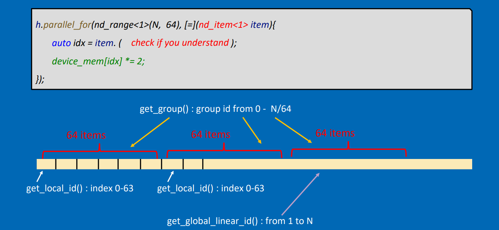
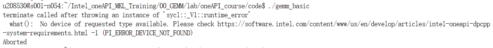
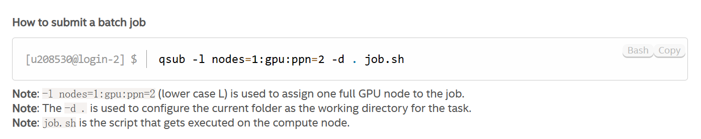
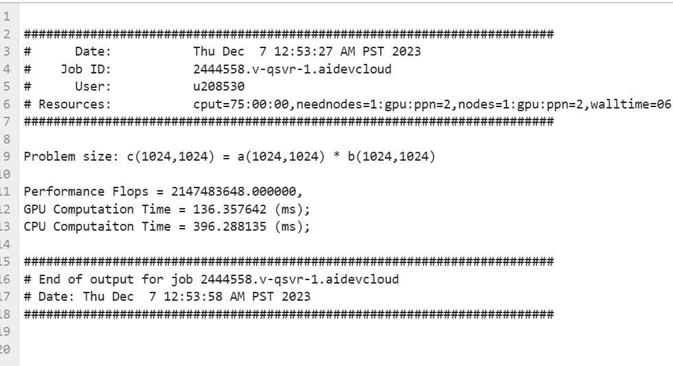
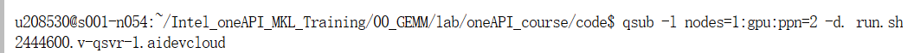
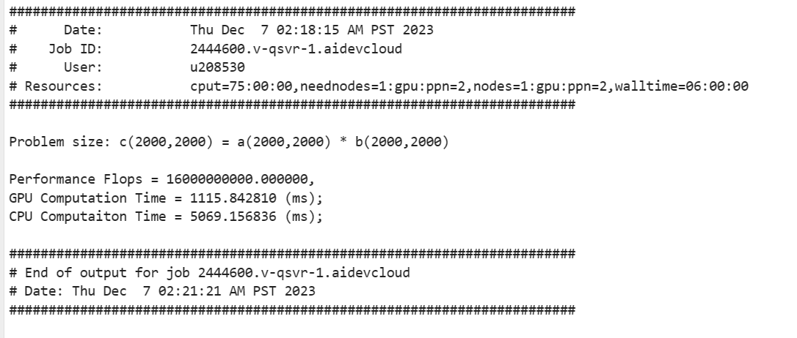
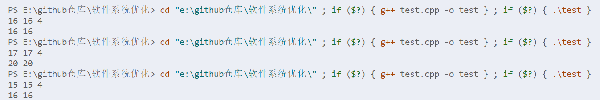

A5
==

## 1

**改写gemm\_basic代码26，27行，利用work group和local work item的坐标来计算global坐标**

我们可以回忆一下上课讲到这块时ppt上面的例子：



想要获得全局id，需要先将group\_id乘每个group中item的数量，最后再加上自身在group中的索引即可：

```cpp
// int row = index.get_global_id(0);
int row = index.get_group(0) * block_size + index.get_local_id(0);
// int col = index.get_global_id(1);
int col = index.get_group(1) * block_size + index.get_local_id(1);
```

## 2

**修改程序输入数据的大小，设定非M=N=K=2000，修改程序，并使其通过正确性测试**

虽然我平时写C++比较多，但是对于并行计算这方面是基本不了解的，所以我想先来解释下代码：

```cpp
  auto grid_rows = (M + block_size - 1) / block_size * block_size;
  auto grid_cols = (N + block_size - 1) / block_size * block_size;
  auto local_ndrange  = range&lt;2&gt;(block_size, block_size);
  auto global_ndrange = range&lt;2&gt;(grid_rows, grid_cols);

  double duration = 0.0f;
  auto e = q.submit([&amp;](sycl::handler &amp;h) {
      h.parallel_for<class k_name_t="">(
          sycl::nd_range&lt;2&gt;(global_ndrange, local_ndrange), [=](sycl::nd_item&lt;2&gt; index) {

              // int row = index.get_global_id(0);
              int row = index.get_group(0) * block_size + index.get_local_id(0);
              // int col = index.get_global_id(1);
              int col = index.get_group(1) * block_size + index.get_local_id(1);
              
              float sum = 0.0f;

              for (int i = 0; i &lt; K; i++) {
                sum += A[row * K + i] * B[i * N  + col];
              }
              C[row * N + col] = sum;
          });
    });
    e.wait();
```

赵老师解释过，矩阵乘法的三重循环中能够并行化的只有第一个和第二个循环。第三重循环是不能并行化的，因为写入的是同一个地方C\[i\]\[j\]，会产生冲突。并行化的基本思路是用一个blcok\_size \* block\_size大小的group来处理global\_ndarray大小的范围。index是二维的，可以获得其x方向和y方向的值，也就是它在global情况下的真实的索引。至于lambda表达式中的具体实现其实和普通的实现其实差不多，也就不多加赘述，下面开始正式做实验。

我最开始想先按照原来的版本跑一下看看输出结果，所以我配置了oneAPI的环境变量后就使用dpcpp进行编译，但是出现了以下的warning：

```shell
u208530@s001-n054:~/Intel_oneAPI_MKL_Training/00_GEMM/lab/oneAPI_course/code$ dpcpp gemm_basic.cpp -o gemm_basic
icpx: warning: use of 'dpcpp' is deprecated and will be removed in a future release. Use 'icpx -fsycl' [-Wdeprecated]
gemm_basic.cpp:154:33: warning: 'gpu_selector' is deprecated: Use the callable sycl::gpu_selector_v instead.
      [-Wdeprecated-declarations]
  queue my_gpu_queue( cl::sycl::gpu_selector{} , propList);
                                ^
/glob/development-tools/versions/oneapi/2023.2.0.1/oneapi/compiler/2023.2.1/linux/bin-llvm/../include/sycl/device_selector.hpp:62:21: note: 
      'gpu_selector' has been explicitly marked deprecated here
class __SYCL_EXPORT __SYCL2020_DEPRECATED(
                    ^
/glob/development-tools/versions/oneapi/2023.2.0.1/oneapi/compiler/2023.2.1/linux/bin-llvm/../include/sycl/detail/defines_elementary.hpp:55:40: note: 
      expanded from macro '__SYCL2020_DEPRECATED'
#define __SYCL2020_DEPRECATED(message) __SYCL_DEPRECATED(message)
                                       ^
/glob/development-tools/versions/oneapi/2023.2.0.1/oneapi/compiler/2023.2.1/linux/bin-llvm/../include/sycl/detail/defines_elementary.hpp:46:38: note: 
      expanded from macro '__SYCL_DEPRECATED'
#define __SYCL_DEPRECATED(message) [[deprecated(message)]]
                                     ^
gemm_basic.cpp:154:9: warning: 'queue' is deprecated: SYCL 1.2.1 device selectors are deprecated. Please use SYCL 2020
      device selectors instead. [-Wdeprecated-declarations]
  queue my_gpu_queue( cl::sycl::gpu_selector{} , propList);
        ^
/glob/development-tools/versions/oneapi/2023.2.0.1/oneapi/compiler/2023.2.1/linux/bin-llvm/../include/sycl/queue.hpp:343:3: note: 
      'queue' has been explicitly marked deprecated here
  __SYCL2020_DEPRECATED("SYCL 1.2.1 device selectors are deprecated. Please "
  ^
/glob/development-tools/versions/oneapi/2023.2.0.1/oneapi/compiler/2023.2.1/linux/bin-llvm/../include/sycl/detail/defines_elementary.hpp:55:40: note: 
      expanded from macro '__SYCL2020_DEPRECATED'
#define __SYCL2020_DEPRECATED(message) __SYCL_DEPRECATED(message)
                                       ^
/glob/development-tools/versions/oneapi/2023.2.0.1/oneapi/compiler/2023.2.1/linux/bin-llvm/../include/sycl/detail/defines_elementary.hpp:46:38: note: 
      expanded from macro '__SYCL_DEPRECATED'
#define __SYCL_DEPRECATED(message) [[deprecated(message)]]
                                     ^
2 warnings generated.
gemm_basic.cpp:154:33: warning: 'gpu_selector' is deprecated: Use the callable sycl::gpu_selector_v instead.
      [-Wdeprecated-declarations]
  queue my_gpu_queue( cl::sycl::gpu_selector{} , propList);
                                ^
/glob/development-tools/versions/oneapi/2023.2.0.1/oneapi/compiler/2023.2.1/linux/bin-llvm/../include/sycl/device_selector.hpp:62:21: note: 
      'gpu_selector' has been explicitly marked deprecated here
class __SYCL_EXPORT __SYCL2020_DEPRECATED(
                    ^
/glob/development-tools/versions/oneapi/2023.2.0.1/oneapi/compiler/2023.2.1/linux/bin-llvm/../include/sycl/detail/defines_elementary.hpp:55:40: note: 
      expanded from macro '__SYCL2020_DEPRECATED'
#define __SYCL2020_DEPRECATED(message) __SYCL_DEPRECATED(message)
                                       ^
/glob/development-tools/versions/oneapi/2023.2.0.1/oneapi/compiler/2023.2.1/linux/bin-llvm/../include/sycl/detail/defines_elementary.hpp:46:38: note: 
      expanded from macro '__SYCL_DEPRECATED'
#define __SYCL_DEPRECATED(message) [[deprecated(message)]]
                                     ^
gemm_basic.cpp:154:9: warning: 'queue' is deprecated: SYCL 1.2.1 device selectors are deprecated. Please use SYCL 2020
      device selectors instead. [-Wdeprecated-declarations]
  queue my_gpu_queue( cl::sycl::gpu_selector{} , propList);
        ^
/glob/development-tools/versions/oneapi/2023.2.0.1/oneapi/compiler/2023.2.1/linux/bin-llvm/../include/sycl/queue.hpp:343:3: note: 
      'queue' has been explicitly marked deprecated here
  __SYCL2020_DEPRECATED("SYCL 1.2.1 device selectors are deprecated. Please "
  ^
/glob/development-tools/versions/oneapi/2023.2.0.1/oneapi/compiler/2023.2.1/linux/bin-llvm/../include/sycl/detail/defines_elementary.hpp:55:40: note: 
      expanded from macro '__SYCL2020_DEPRECATED'
#define __SYCL2020_DEPRECATED(message) __SYCL_DEPRECATED(message)
                                       ^
/glob/development-tools/versions/oneapi/2023.2.0.1/oneapi/compiler/2023.2.1/linux/bin-llvm/../include/sycl/detail/defines_elementary.hpp:46:38: note: 
      expanded from macro '__SYCL_DEPRECATED'
#define __SYCL_DEPRECATED(message) [[deprecated(message)]]
                                     ^
2 warnings generated.
```

可以看到，问题在于：

*   dpcpp已经被弃用，推荐使用icpx -fsycl
*   gpu\_selector和queue已经在SYCL 1.2.1中被弃用，推荐使用sycl::gpu\_selector\_v替代gpu\_selector并更新代码中使用的queue构造函数来适应SYCL2020标准

可能所给出的代码是很久以前写的了，所以才会出现被弃用的情况。不过都是warning，而且这也不是本次实验的重点，所以我也就没有加以修改。

我接下来就很自然地想运行gemm\_basic，但却出现了一点问题：



报错的意思是没有我们所要求的设备。我查了很久解决方法，参考了官方文档：[Job Submission | Intel® DevCloud](https://devcloud.intel.com/oneapi/documentation/job-submission/)，才找到了解决方法。我这里的问题在于原因我所处的节点是没有GPU的。应该用qsub命令，把作业写成一个shell脚本。然后再把作业提交给排队系统，排队系统会自动指派符合要求的节点，也就是那些有GPU的节点，来完成作业。最后，输出的结果会被传回到本地节点。

来看看我写的run.sh:

```shell
#!/bin/bash
source /opt/intel/oneapi/setvars.sh &gt; /dev/null 2&gt;&amp;1
dpcpp gemm_basic.cpp -o gemm_basic
if [ $? -eq 0 ]; then ./gemm_basic; fi
```

source /opt/intel/oneapi/setvars.sh是用来配置环境变量的，而 > /dev/null 2>&1的作用是将脚本的输出信息重定向到/dev/null上，不显示在终端上，使得我们的shell不会被输出信息狂轰滥炸。

第三行就是使用dpcpp进行编译。

第四行检查前一个命令是否成功执行。$? 是上一个命令的退出状态码，-eq 0表示上一个命令成功执行。如果编译成功，则运行生成的可执行文件。

根据上面提到的文档中的：



直接输入qsub -l nodes=1:gpu:ppn=2 -d . run.sh来进行提交即可。（中间不小心关掉了终端，导致没截图）

可以发现得到了两份文件：run.s.e2444558和run.s.o2444558。前者是一些报错的信息，后者就是我们想要的输出内容：



可以看到当N=M=K=1024的时候，是能够正确运行的。

接下来就是要修改N=M=K=2000了，很自然的：

```cpp
  // int errCode = gemm(1024, 1024, 1024, 4, 10, my_gpu_queue);
  int errCode = gemm(2000, 2000, 2000, 4, 10, my_gpu_queue);
```

虽然赵老师上课提到还需要修改其他地方的代码来应对一些边界情况，但是我怀着侥幸心理没有进一步修改其他代码，直接尝试运行：



生成了run.sh.o2444600和run.sh.e2444600两份文件。我们看run.sh.o2444600文件：



居然就这么成功了！怎么判断出来成功了，源代码中有这么一行：

```cpp
  errCode = verify(C_host, C, M*N);
  if(errCode &gt; 0) printf("\nThere are %d errors\n", errCode);
```

errcode=0的时候就是verify没问题的时候，而只有errcode>0才会输出上面的语句。也就是说，只要没有输出上面的语句，verify就是没问题的。

但这是为什么呢？我仔细阅读了源代码后，发现是下面的代码的作用：

```cpp
  auto grid_rows = (M + block_size - 1) / block_size * block_size;
  auto grid_cols = (N + block_size - 1) / block_size * block_size;
```

上面代码的作用是确保grid\_rows是blcok\_size的倍数。如果M是block\_size的整数倍，那么第一行等号右边的式子实际上就是M，而如果M不是block\_size的整数倍，这个计算将向上取整到最接近的blcok\_size的倍数。N的情况是类似的。下面我就通过测试代码来验证下：

```cpp
#include <iostream>

int main() {
    int M, N, block_size;
    std::cin&gt;&gt;M&gt;&gt;N&gt;&gt;block_size;
    auto grid_rows = (M + block_size - 1) / block_size * block_size;
    auto grid_cols = (N + block_size - 1) / block_size * block_size;
    std::cout&lt;</iostream>```
```



实验的结果与我们的分析是一致的。因为这里的特殊处理，我直接将1024改成2000也能运行成功。