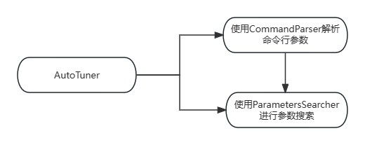
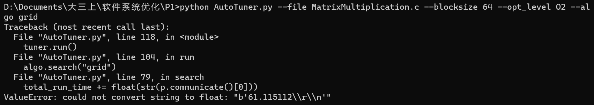
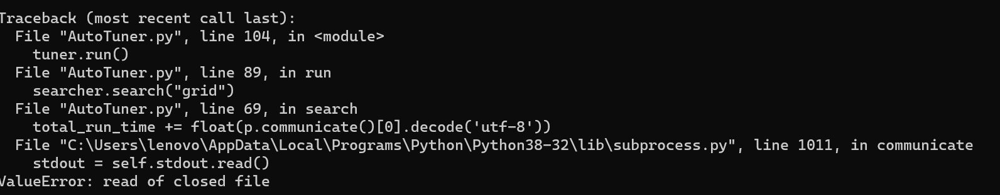
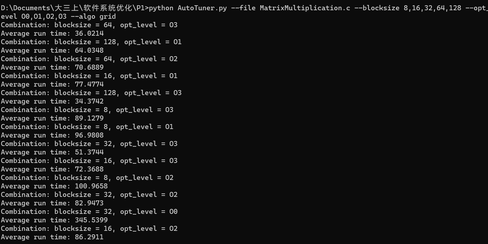
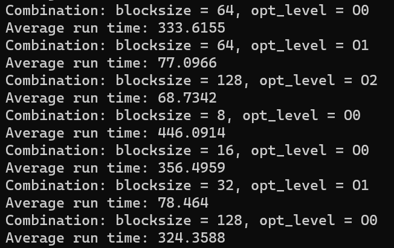
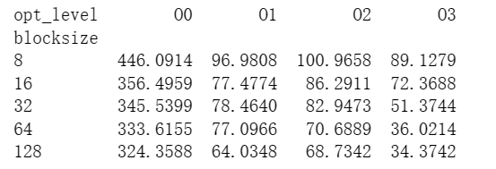
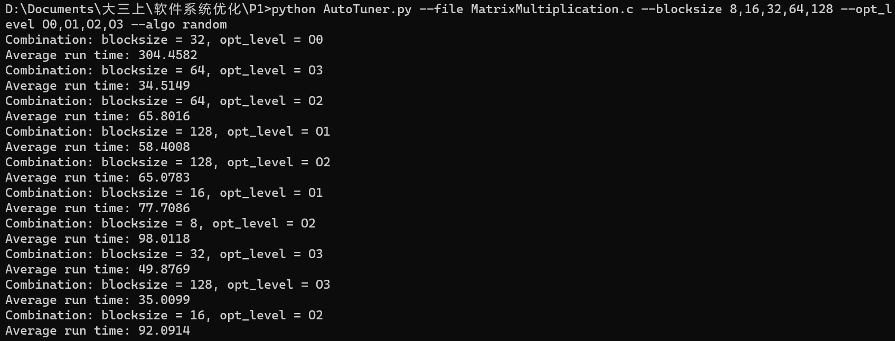
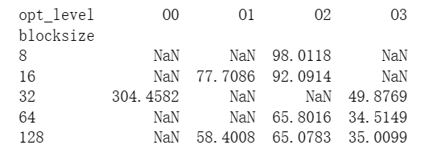

P1
==

项目结构
----



### CommandParser

我设计了一个类来解析用户所输入的命令行参数。在这个类当中我使用了python标准库中的getopt。熟悉Linux的大家应该知道，在Linux系统编程中getopt是解析命令行参数的必备工具。而getopt模块就是python提供的一个与传统的 Unix 命令行参数解析风格兼容的接口。

在python中其实还可以使用argparse模块来解析命令行参数。它相比起getopt来说，功能更加强大，也更加灵活。比如说，argparse还支持子命令和参数验证等高级功能，而getopt却不支持。但是呢，在本次项目中，需要解析的命令格式是很简单的，用不到高级功能，而getopt相比之下要更加轻量级，故使用getopt。

总共需要收集四个参数：

*   \--file -f : 文件路径
*   \--blocksize -b : 循环分块大小
*   \--opt\_level -o : 编译优化等级
*   \--algo -a : 参数值搜索算法

其中，blocksize，opt\_level和algo都是有默认值的，但是file是必须要指定的。

解析完成之后，我们可以得到一个字典，键是参数名，值是参数的具体取值。

### ParameterSearcher

这个类是用来执行具体的参数搜索算法的。我在本次实验中选择实现了GridSearch和RandomSearch两个参数搜索算法。

这个类需要使用CommandParser的parse方法返回的字典进行初始化。而在执行search方法的时候还需要接受search\_type作为参数，来判断执行GridSearch还是RandomSearch。

### GridSearch与RandomSearch的设计思想

其实可以说RandomSearch就是GridSearch。只不过GridSearch是遍历全部的参数组合，而RandomSearch只是挑选了所有参数组合中的几个，来减少搜索的时间。

一种比较自然的实现方式就是分别定义两个函数，来分别实现GridSearch和RandomSearch。GridSearch就是两重循环分别遍历两个参数中的所有取值，然后运行程序，记录时间。而RandomSearch就是要先尝试生成两个参数所有的组合可能，然后通过random模块随机抽取。

但是为了减少冗余，我最后写成了一个函数。原因在于，GridSearch中也可以提前生成所有参数的组合，然后用一重循环遍历即可。而对于RandomSearch来说，也可以不在循环当中随机选取，而是先将现有的参数组合全部打乱，然后按顺序取就好了。

我这样设计能够让代码更加紧凑，避免了重复的代码段，而且也并没有降低可读性。因为GridSearch和RandomSearch的逻辑其实是非常相似的，有很多共通的地方。但是一个缺点就在于扩展性不强，具体我将在后面分析缺点的时候分析。

### python中执行外部命令

在python中执行外部命令需要使用到subprocess库，其中关键方法是:

```python
p = subprocess.Popen(exec_cmd, stdout=subprocess.PIPE)
total_run_time += float(p.communicate()[0].decode('utf-8'))
```

其中的exec\_cmd是一个字符串列表，每个字符串代表一个命令行参数。subprocess.Popen创建了一个新的进程并返回一个 Popen 对象，它可以用于与该进程进行交互。stdout=subprocess.PIPE将进程的标准输出连接到管道中，以便捕获。

p.communicate()会返回一个包括标准输出和标准错误的元组。在这里我们只关注标准输出，因为MatrixMultiplication最后会输出用时。但是这里的标准输出是一个字节串，需要通过decode('utf-8')来解码成字符串，最后转化为浮点数即可。



这里的报错就是在说明p.communicate()\[0\]是一个字节串，如果没有解码就直接转化为float，会多出一些额外的内容。比如说前缀的b表示字节序列，而\\\\r\\\\n其实就是windows系统中文本文件的换行。



这里报错是因为我在通过print调试程序的时候，已经读取了一次。这时候管道就关闭了，而我转化为float的那条语句没有删除，导致读取了一个已经关闭的管道。

### AutoTuner

AutoTuner类当中基本就是调用上述两个类的接口，实现自动调优。

优点
--

*   各个模块之间的耦合度应该还是算比较低的，因为模块互相之间的交流差不多只使用到了一个接口。CommandParser用来解析命令行参数，AutoTuner将获得命令行参数传入ParameterSearcher当中，进行参数搜索。

### 缺点

*   测试的时候是单线程的，而opentuner是多线程的，导致效率会非常低。我跑完这次实验大概用了五个半小时差不多。
*   可扩展性还不足够，以下是几个还可以改进的地方：
    *   我目前对GridSearch和RandomSearch实现的方式不便于未来加入新的参数搜索算法。因为现在GridSearch和RandomSearch相当于是在一个函数当中，因为这俩其实实现上很相似。但是，新的搜索算法多半实现上是截然不同的，如果还放在一个函数中就会使得逻辑变得很复杂，可读性低。可扩展性更高的做法就是GridSearch和RandomSearch各自用一个函数实现，新增加搜索算法就在ParametersSearchers中增加函数。
    *   由于本次项目中是c文件，默认编译器是gcc。要是在实际应用中肯定会面对不同类型的文件，所以需要不同的编译器。一个自然的想法是，可以专门再定义一个Compile模块，可以自定义编译器。当然，这样的话，就必须要在search前把不同编译优化水平的文件都编译好，就不能像我目前的实现一样，等到需要用时再编译。

结果分析
----

### 不同组合的性能差异

为了避免偶然性，我对于每一个参数组合都做了5次search，并取了平均值。

GridSearch：





grid-results.txt中的内容为：

```Plain Text
Combination: blocksize = 64, opt_level = O3
Average run time: 36.0214
Combination: blocksize = 128, opt_level = O1
Average run time: 64.0348
Combination: blocksize = 64, opt_level = O2
Average run time: 70.6889
Combination: blocksize = 16, opt_level = O1
Average run time: 77.4774
Combination: blocksize = 128, opt_level = O3
Average run time: 34.3742
Combination: blocksize = 8, opt_level = O3
Average run time: 89.1279
Combination: blocksize = 8, opt_level = O1
Average run time: 96.9808
Combination: blocksize = 32, opt_level = O3
Average run time: 51.3744
Combination: blocksize = 16, opt_level = O3
Average run time: 72.3688
Combination: blocksize = 8, opt_level = O2
Average run time: 100.9658
Combination: blocksize = 32, opt_level = O2
Average run time: 82.9473
Combination: blocksize = 32, opt_level = O0
Average run time: 345.5399
Combination: blocksize = 16, opt_level = O2
Average run time: 86.2911
Combination: blocksize = 64, opt_level = O0
Average run time: 333.6155
Combination: blocksize = 64, opt_level = O1
Average run time: 77.0966
Combination: blocksize = 128, opt_level = O2
Average run time: 68.7342
Combination: blocksize = 8, opt_level = O0
Average run time: 446.0914
Combination: blocksize = 16, opt_level = O0
Average run time: 356.4959
Combination: blocksize = 32, opt_level = O1
Average run time: 78.464
Combination: blocksize = 128, opt_level = O0
Average run time: 324.3588
Best combination: 128 O3
Best average run time: 34.3742

```

用pandas读取文件绘制成表格：



RandomSearch:



random-results.txt中的内容为:

```Plain Text
Combination: blocksize = 32, opt_level = O0
Average run time: 304.4582
Combination: blocksize = 64, opt_level = O3
Average run time: 34.5149
Combination: blocksize = 64, opt_level = O2
Average run time: 65.8016
Combination: blocksize = 128, opt_level = O1
Average run time: 58.4008
Combination: blocksize = 128, opt_level = O2
Average run time: 65.0783
Combination: blocksize = 16, opt_level = O1
Average run time: 77.7086
Combination: blocksize = 8, opt_level = O2
Average run time: 98.0118
Combination: blocksize = 32, opt_level = O3
Average run time: 49.8769
Combination: blocksize = 128, opt_level = O3
Average run time: 35.0099
Combination: blocksize = 16, opt_level = O2
Average run time: 92.0914
Best combination: 64 O3
Best average run time: 34.5149

```

用pandas读取文件绘制成表格：



可以看出，GridSearch寻找到的最优参数组合是blocksize=128，opt\_level=O3，用时为34.3742。而RandomSearch寻找到的最优参数组合是blcoksize=64，opt\_level=O3，用时为34.5149。这两个参数组合在两个参数搜索算法中时间差距微乎其微，可以认为都是最优解。

我们可以访问[https://gcc.gnu.org/onlinedocs/gcc-4.9.4/gcc/Optimize-Options.html#Optimize-Options来了解](https://gcc.gnu.org/onlinedocs/gcc-4.9.4/gcc/Optimize-Options.html#Optimize-Options来了解O0) O0、O1、O2和O3之间的差别：

*   O0：不做任何优化，它是默认的编译选项
*   O1：做部分的编译优化。对于大函数来说，优化编译会占用较多的时间和内存。编译器会尝试减小代码的大小，减少执行时间，但不会去执行那些需要很多编译时间的优化。
*   O2：比O1更加高级。gcc几乎会启用所有的没有囊括时间空间trade-off的优化。编译器不会执行loop unrolling以及展开内联函数。
*   O3：O3就是重量级了，它将在O2基础上进行更多的优化。

我们可以发现以下几点：

*   对于相同的优化等级，基本上是blocksize越大运行时间越短的。这是比较直觉的，因为当分块越大时，每个分块内的计算更加集中，就能够更好地利用 CPU 缓存。但是，这可不是说明分块越大越好。如果分块很大很大，那么分块不能被完整的送进缓存。数据无法利用好缓存，就会被置换出去，反而会导致缓存命中率降低。
*   对于相同的blocksize，大体趋势是优化等级越高，时间越短。只是在从O1到O2的转化中，5个blocksize中有4个速度是时间变长的。我的猜想是，O2比O1多出来的优化其实没起到什么实际作用，反而O2为了这些多出来的优化导致的编译时间的增加是很显著的，导致了这种现象。

### 搜索算法的优劣

其实前面已经说的差不多了。GridSearch要遍历全部的20种参数组合，而RandomSearch只需要遍历一部分即可。而具体遍历多少，是由我自己决定的，我在本次项目中定的是10。

我快跑完的时候才发现我虽然记时了，但是忘记将这两种算法的用时输出了......不过所幸是上课的时候跑的，我记得具体的时间点。GridSearch大致上用了五个小时的时间，大概是从13点多到17点五十几的时间；而RandomSearch大致上用了一个半小时，大概是从18:30到19点58分。因为我将从RandomSearch中选取参数组合个数定为10，所以运行时间应该是在两个半小时左右，但实际非常快，因为随机到的参数组合都是比较快的。

速度上肯定是RandomSearch更加优秀了，而且它可以说也给出了最优解。当然，这也不过是我运气好罢了。如果既没有随机到O3和128与O3和64，那么RandomSearch就无法给出最优解。

综上，如果参数的数量比较少，可以使用GridSearch，因为它一定能给出最优解。但是如果参数的数量实在是太多，GridSearch就会消耗大量的时间。所以，当参数的数量实在是很多，实在是等不起的时候，那么就应该使用RandomSearch，它能给出一个局部最优解。