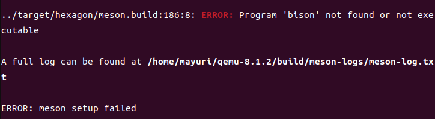
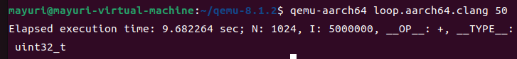
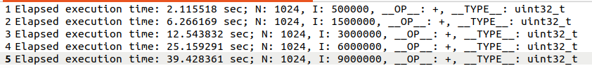
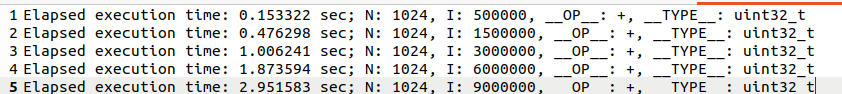

P2
==

1
-

**在 Ubuntu 上安装能够运行 aarch64 (64-bit ARM ISA)应用的 Qemu 虚拟机**

我在[Download QEMU - QEMU](https://www.qemu.org/download/)上找到了安装方式：


当我执行./configure，出现了下面的报错：


报错信息的意思是python虚拟环境创建失败了。

我参考了[How can I run another OS from a Devuan running from a live USB stick? / Devuan / Dev1 Galaxy Forum](https://dev1galaxy.org/viewtopic.php?id=5805)中楼主的解决方式，去下载了更老版本的qemu，但是下载时间实在是太感人了遂作罢：


接下来我又参考了这个链接：[Software Pragmatism - Cannot Create a Python Virtual Environment On Ubuntu - ensurepip is not available](https://www.softwarepragmatism.com/cannot-create-a-python-virtual-environment-on-ubuntu-ensurepip-is-not-available)。这篇文章说ubuntu在python3.4之后就取消了对ensurepip的支持，所以在第一次创建python虚拟环境的时候就会出错。于是乎，就需要我们自己手动运行：

```null
sudo apt-get install python3-venv
```


可以看到能够成功执行下去了。而且，直到这时候我才回过味来，好像在最初的报错信息中就可以看到：


而我还花了额外的时间去搜索引擎上搜索......

这件事情告诉我们要认真读报错信。

之后卡在了这里：


顿时，我的心中就有了不祥的预感，果不其然：


但是就在我尝试解决问题的时候我的D盘满了，虚拟机直接退出。我清理了D盘空间重复之前的操作后，发现上述的问题居然解决了：


只不过取而代之的是一个新问题。

没有Ninja，安装就行了，但是安装的过程中又出现了新的问题：


我参考了这个链接：[dpkg 被中断，您必须手工运行 ‘sudo dpkg --configure -a’ 解决此问题解决方法-CSDN博客](https://blog.csdn.net/qq_36761831/article/details/89298111)。最终成功解决了上面的问题，之后再尝试安装Ninja:


之后再度运行./configure，又出现了报错：


这次是缺少glib-2.0的问题，安装就好：


./configure之后又出现了报错：


再度安装：


./configure后又是喜闻乐见的问题：


安装：


继续出现问题：



继续安装：


最后一次./configure总算是成功了！


make之后等待了很长时间，最终成功：


接下来再使用make install安装即可，但是又发生了奇怪的报错：


可以看到是一个permission denied，所以只需要在make install前加上sudo即可：


安装成功的验证：


2
-

**安装aarch64的GCC工具链**


安装成功的验证：


3
-

**用 aarch64 的 GCC 工具链交叉编译 loop.c (-O2)，生成可执行文件 loop.aarch64.gcc，并用 qemu-aarch64 运行loop.aarch64.gcc**

编译命令行：

```null
aarch64-linux-gnu-gcc-10 -O2 -static loop.c -o loop.aarch64.gcc
```

qemu 运行的命令行：

```null
qemu-aarch64 loop.aarch64.gcc 50
```

运行结果：


4
-

**用 clang 交 叉 编 译 loop.c(-O2) ， 生 成 可 执 行 文 件loop.aarch64.clang ， 并 用 qemu-aarch64 运 行loop.aarch64.clang**

编译命令行：

```null
clang -target aarch64-linux-gnu -O2 -static loop.c -o loop.aarch64.clang
```

qemu运行的命令行：

```null
qemu-aarch64 loop.aarch64.clang 50
```

qemu运行的结果截图：



5
-

**用 qemu-aarch64 分 别 运 行 前 面 编 译 出 来 的loop.aarch64.gcc 和 loop.aarch64.clang（分别用参数5、15、30、60、90 进行测试），记下每次测试的执行时间并以图形方式呈现。**


result\_gcc.txt中内容：



result\_clang.txt中内容：


### loop.c代码解释

在进行测试结果图示化展现之前，我想要先来具体介绍下loop.c到底做了些什么事情。

```null
#define N          1024
#define I          100000
```

定义了常量N表示数组的大小，以及I表示每次实验的迭代次数。这里的N必须要足够小，使得数组可以完全放入l1-cache当中。我做了下简略的计算，由后面可知，数组的默认元素类型为uint32\_t，三个数组的总大小为：4 Bytes \* 1024 \* 3 = 12288 Bytes = 12 KB。我使用lscpu看了看我的l1-cache大小：


可以看到是绝对放得下的。

```null
#ifndef __OP__
#define __OP__     +
#endif
#ifndef __TYPE__
#define __TYPE__   uint32_t
#endif
```

定义了两个宏\_\_OP\_\_和\_\_TYPE\_\_，它们分别表示数组元素的操作符和数据类型。如果在编译时没有通过-D参数指定这两个宏，它们将默认为+和uint32\_t。

```null
#define stringify(V) _stringify(V)
#define _stringify(V) #V

```

这两个宏用于将宏的值转换为字符串。在输出结果中，\_\_OP\_\_和 \_\_TYPE\_\_的值将以字符串形式显示。

```null
__TYPE__ A[N];
__TYPE__ B[N];
__TYPE__ C[N];
```

定义了三个长度为N的数组 A、B 和 C，用于进行操作和存储结果。

```null
IterMul = atoi(argv[1]);
assert(IterMul &gt; 0 &amp;&amp; IterMul &lt;=100);
assert(IterMul*I &gt; 0);
```

从命令行参数中获取迭代次数的倍数，并进行一些基本的验证。从这里可以看出，我们传入的参数其实就是迭代次数的倍数。

```null
for (j = 0; j &lt; N; j++) {
    A[j] = 0;
    B[j] = 0;
    C[j] = 0;
}
```

这一步不仅仅是初始化元素这么简单，它同时将数组元素全部放入了l1-cache当中，

```null
for (i = 0; i &lt; IterMul*I; i++) {
    for (j = 0; j &lt; N; j++) {
        C[j] = A[j] __OP__ B[j];
    }
}
```

这里就是具体要测量时间的操作。根据助教在上次实验课上所讲的内容，这个过程是可以进行向量化的。因为三个数组识别独立定义的，不会存在overlap的情况。

```null
double elapsedf = tdiff(time1, time2);
printf("Elapsed execution time: %f sec; N: %d, I: %d,"
       " __OP__: %s, __TYPE__: %s\n",
       elapsedf, N, IterMul*I, stringify(__OP__), stringify(__TYPE__));
```

计算和输出程序执行的总时间，包括数组操作符和数据类型。

在看懂loop.c究竟做了什么之后，再来看看测试结果。

测试结果图示化呈现:


可以看到，随着迭代次数的增加，运行时间基本上呈现一个线性增长的趋势。而且，使用clang进行跨平台编译得到的文件的运行时间要远小于用gcc进行跨平台编译得到的文件的运行时间，两者之间的差距随着迭代次数的增加而进一步增大。因为loop.c前面我也已经分析了，是可以进行向量化的。所以，对于这个结果最直观的一个解释就是：针对aarch64来说，clang使用了向量化而gcc没有使用向量化。当然，也可能是都启用了向量化，只不过clang要比gcc做的更加好。为了验证我的猜想，我使用了黄波老师推荐的[https://godbolt.org/z/ab9sfvEra](https://godbolt.org/z/ab9sfvEra) 进行了探索：


这是clang所产生的汇编代码：


这是gcc所产生的汇编代码：


可以看到这个工具还是很智能的，源代码和汇编代码之间的对应关系都用颜色标注出来了。我们可以直接看向C\[j\] = A\[j\] \_\_OP\_\_ B\[j\]所对应的汇编代码，clang的是：

```null
movdqa  4128(%rsp,%rax,4), %xmm0
movdqa  4144(%rsp,%rax,4), %xmm1
movdqa  4160(%rsp,%rax,4), %xmm2
movdqa  4176(%rsp,%rax,4), %xmm3
paddd   8224(%rsp,%rax,4), %xmm0
paddd   8240(%rsp,%rax,4), %xmm1
movdqa  %xmm0, 32(%rsp,%rax,4)
movdqa  %xmm1, 48(%rsp,%rax,4)
paddd   8256(%rsp,%rax,4), %xmm2
paddd   8272(%rsp,%rax,4), %xmm3
movdqa  %xmm2, 64(%rsp,%rax,4)
movdqa  %xmm3, 80(%rsp,%rax,4)
```

gcc的是：

```null
.L11:
        xorl    %eax, %eax
.L10:
        movl    $0, (%rbx,%rax)
        addq    $4, %rax
        cmpq    $4096, %rax
        jne     .L10
        addl    $1, %r12d
        cmpl    %edx, %r12d
        jne     .L11
```

clang生成的汇编代码中的xmm已经告诉了我们所有，而gcc所执行的就是朴实无华的逐元素相加。也就是说，clang启用了向量化，而gcc没有启用向量化。

6
-

**用 host 机 器 上 的 gcc 和 clang 分 别 编 译 (-O2) 出loop.x64.gcc 和 loop.x64.clang，并对这两个执行文件分别用参数 5、15、30、60、90 进行测试，记下每次测试的执行时间并以图形方式呈现，进而与前一步 qemu 仿真测试的结果进行比较。**

编译命令行：

```null
gcc -O2 -static loop.c -o loop.x64.gcc
clang -O2 -static loop.c -o loop.x64.clang
```

result\_gcc.txt2的内容：



result\_clang2.txt的内容：


测试结果图示化呈现:


为了能够更加清晰地进行比较，我将任务5中得到的数据也画入了图中。

可以看到，无论是gcc还是clang，在x64上的运行时间要显著小于aarch64上的运行时间。我对于这个现象的原因有两个猜测：

*   x64平台在向量化上做的比aarch64好。
*   因为本次项目中要求用qemu模拟aarch64环境，既然是模拟，那就肯定需要转换指令。正因为这多出来的转化过程导致aarch64要比x64慢的多。

另外，和我们在任务5中观察到的一样，无论是在aarch64上还是x64上，clang在向量化上的表现都要好于gcc。

7
-

**安装支持多 ISA 的 gdb 调试器**


安装成功的验证：


8
-

**用 gdb-multiarch 结 合 qemu-aarch64 对loop.aarch64.gcc.debug 进行源码级调试**

编译生成带调试信息的 loop.aarch64.gcc.debug:

```null
aarch64-linux-gnu-gcc-10 -O2 -static -ggdb loop.c -o loop.aarch64.gcc.debug
```

调试方法简介：

先使用下面的命令将gdb端口指定为5000

```null
qemu-aarch64 -g 5000 ./loop.aarch64.gcc.debug 25
```

执行后发现被阻塞住了：


另外开启一个终端，运行gdb-multiarch，进入gdb界面：


因为我们要调试的程序为aarch64平台上的程序，所以要对gdb进行设置，之后再连接我们第一步中指定的端口：


之后的过程就和我们平时使用gdb没什么两样了。但是当我设好断点，准备开run的时候，出现了下述报错：


这是在告诉我们要用continue来代替run。

调试方法截屏：


总结
--

安装qemu的过程还是相当曲折的，需要安装的东西很多，等待的时间也很长，中间还碰到奇奇怪怪的报错，一度以为自己要折戟在配置上了，万幸安装成功，最后也成功完成了项目。

遇到报错不要心急，要认真的看报错的信息，有时候解决的方法是很简单很简单的。一看到报错就头大，进而放弃思考的话，效率就会很低了。

使用了黄波老师推荐的可以生成汇编代码的工具，并且最终通过这个工具成功验证了自己的猜想，还是蛮有成就感的。

其实任务五和任务六当中应该进行多次测试最后取平均值，这样能够减小误差，使得实验结果更加精确，但是很可惜直到我快要做完这个项目我才意识到这一点。不过对汇编代码的分析是完美符合实验现象的，我也就不重新进行测试了。

附录
--

python绘图代码

```null
import matplotlib.pyplot as plt

x_values = [5, 15, 30, 60, 90]
gcc_time = [2.115518, 6.266169, 12.543832, 25.159291, 39.428361]

clang_time = [0.981404, 2.966977, 5.474136, 9.201605, 13.987631]


plt.figure(figsize=(10, 6))

plt.plot(x_values, gcc_time, marker='o', label='GCC')

plt.plot(x_values, clang_time, marker='o', label='Clang')

plt.xlabel('Iterations')
plt.ylabel('Elapsed Time (sec)')
plt.title('Elapsed Execution Time for GCC and Clang')
plt.legend()
plt.grid(True)

plt.xticks(x_values)

plt.show()
```
```null
import matplotlib.pyplot as plt

gcc_aarch64_times = [2.115518, 6.266169, 12.543832, 25.159291, 39.428361]
clang_aarch64_times = [0.981404, 2.966977, 5.474136, 9.201605, 13.987631]
gcc_x64_times = [0.153322, 0.476298, 1.006241, 1.873594, 2.951583]
clang_x64_times = [0.054749, 0.165163, 0.324758, 0.653438, 0.975990]

x_values = [5, 15, 30, 60, 90]

plt.plot(x_values, gcc_aarch64_times, label='gcc aarch64', marker='o')
plt.plot(x_values, clang_aarch64_times, label='clang aarch64', marker='o')
plt.plot(x_values, gcc_x64_times, label='gcc x64', marker='o')
plt.plot(x_values, clang_x64_times, label='clang x64', marker='o')

plt.xlabel('Iterations')
plt.ylabel('Elapsed Time (sec)')
plt.legend()
plt.grid(True)

plt.xticks(x_values, [5, 15, 30, 60, 90])

plt.show()
```