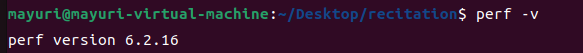
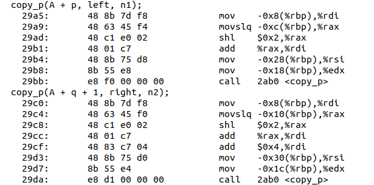

P3
==

Checkoff Item 1
---------------

**Make note of one bottleneck.**


当我想要perf record的时候，我才突然想起在做A4还是P2的时候，由于空间不够引发了很多问题，加上网上能找到的方法全都解决不了我的问题，于是乎我直接恼羞成怒重装了虚拟机。也就是说，目前的虚拟机上我是没有安装perf的，所以我就去安装了：


但是弹出了：


因为linux有不同的发行版本，内核工具也自然不同，上面提示的意思是说我可以下载特定内核版本下的tools：




成功。

之后就可以回归正轨了：


又出现了权限问题：


sudo之后就成功了。

perf report出现了如下界面：


可以看到99.63%的时间都花在了isort上面。选中第一行之后按回车会出现：


再按一次回车会出现：


标注为红色的就是占比比较大的汇编代码。可以发现占比最大的两行分别是：

```assembly
mov -0x29(%rbp),%al // 10.44％
test $0x1,%al // 19.33％
```

但是这里很奇怪，为什么是rax的最后八位和0x1去做位与呢？我们详细来看看汇编代码:

```assembly
cmp  -0x1c(%rbp),%eax                                            ▒
seta %al 
```

这里是说如果-0x1c(%rbp)指向的值小于eax，那么就将al置为1。而根据前面的汇编，-0x1c(%rbp)指向的值是left\[1\]，eax中的值是left\[0\]（前面的汇编代码有点复杂，我就不详细分析了）。也就是说，耗时最长的这两行代码，代表的恰好就是isort.c中的:

```c
while (index >= left && *index > val) {
```

性能瓶颈也就找到了。

**Checkoff Item 2**
-------------------

**Run sum under cachegrind to identify cache performance. It may take a little while. In the output, look at the D1 and LLd misses. D1 represents the lowest-level cache (L1), and LL represents the last (highest) level data cache (on most machines, L3). Do these numbers correspond with what you would expect? Try playing around with the values N and U in sum.c. How can you bring down the number of cache misses?**

同样，我的虚拟机中还没有valgrind:


然后就可以做Checkoff Item 2了：


输出结果为：

```shell
==25705== Cachegrind, a cache and branch-prediction profiler
==25705== Copyright (C) 2002-2017, and GNU GPL'd, by Nicholas Nethercote et al.
==25705== Using Valgrind-3.18.1 and LibVEX; rerun with -h for copyright info
==25705== Command: ./sum
==25705== 
--25705-- warning: L3 cache found, using its data for the LL simulation.
Allocated array of size 10000000
Summing 100000000 random values...
Done. Value = 938895920
==25705== 
==25705== I   refs:      3,440,151,481
==25705== I1  misses:            1,357
==25705== LLi misses:            1,350
==25705== I1  miss rate:          0.00%
==25705== LLi miss rate:          0.00%
==25705== 
==25705== D   refs:        610,049,510  (400,035,620 rd   + 210,013,890 wr)
==25705== D1  misses:      100,546,565  ( 99,920,869 rd   +     625,696 wr)
==25705== LLd misses:       84,952,817  ( 84,327,162 rd   +     625,655 wr)
==25705== D1  miss rate:          16.5% (       25.0%     +         0.3%  )
==25705== LLd miss rate:          13.9% (       21.1%     +         0.3%  )
==25705== 
==25705== LL refs:         100,547,922  ( 99,922,226 rd   +     625,696 wr)
==25705== LL misses:        84,954,167  ( 84,328,512 rd   +     625,655 wr)
==25705== LL miss rate:            2.1% (        2.2%     +         0.3%  )
==25705== 
==25705== Branches:        210,027,109  (110,026,727 cond + 100,000,382 ind)
==25705== Mispredicts:           3,349  (      3,174 cond +         175 ind)
==25705== Mispred rate:            0.0% (        0.0%     +         0.0%   )

```

根据讲义中的解释，D1代表的是L1，而LL代表的是最高等级缓存，后缀d指的是data。我通过lscpu看了看我的虚拟机的缓存情况：


可以看到，我的LL是L3。而且可以注意到，这里的单位并非常见的KB和MB，而是KiB和MiB。它们分别代表2^10和2^20.

先来分析下前面的输出结果。L1和L3的miss率分别为16.5%，13.9%，这是一个比较高的数值了。L3的情况要稍微比L1好上那么一点，可能是因为L3的大小要远大于L1的原因。

为了使得miss率降低，我选择将数组占据的内存大小调整到与缓存差不多的大小。先来针对L1调整，因为L1是128KiB，而int是4字节，所以我将U调整为了32000：


输出：

```shell
==25887== Cachegrind, a cache and branch-prediction profiler
==25887== Copyright (C) 2002-2017, and GNU GPL'd, by Nicholas Nethercote et al.
==25887== Using Valgrind-3.18.1 and LibVEX; rerun with -h for copyright info
==25887== Command: ./sum
==25887== 
--25887-- warning: L3 cache found, using its data for the LL simulation.
Allocated array of size 32000
Summing 100000000 random values...
Done. Value = -2064259024
==25887== 
==25887== I   refs:      3,400,279,500
==25887== I1  misses:            1,367
==25887== LLi misses:            1,345
==25887== I1  miss rate:          0.00%
==25887== LLi miss rate:          0.00%
==25887== 
==25887== D   refs:        600,081,525  (400,035,627 rd   + 200,045,898 wr)
==25887== D1  misses:       74,510,808  ( 74,508,112 rd   +       2,696 wr)
==25887== LLd misses:            3,905  (      1,316 rd   +       2,589 wr)
==25887== D1  miss rate:          12.4% (       18.6%     +         0.0%  )
==25887== LLd miss rate:           0.0% (        0.0%     +         0.0%  )
==25887== 
==25887== LL refs:          74,512,175  ( 74,509,479 rd   +       2,696 wr)
==25887== LL misses:             5,250  (      2,661 rd   +       2,589 wr)
==25887== LL miss rate:            0.0% (        0.0%     +         0.0%  )
==25887== 
==25887== Branches:        200,059,118  (100,058,735 cond + 100,000,383 ind)
==25887== Mispredicts:           3,371  (      3,195 cond +         176 ind)
==25887== Mispred rate:            0.0% (        0.0%     +         0.0%   )
```

可以发现，L1的miss率降低了4.1%，而L3的miss率直接降到了0%。L1的miss率这并没有达到我的预期，于是我选择将U进一步减少到2000，输出结果为：

```shell
==25972== D1  miss rate:           9.9% (       14.8%     +         0.0%  )
==25972== LLd miss rate:           0.0% (        0.0%     +         0.0%  )
```

可以看到L1miss率进一步降低了2.5%，我再将U降低到10000：

```shell
==25985== D1  miss rate:           3.1% (        4.6%     +         0.0%  )
==25985== LLd miss rate:           0.0% (        0.0%     +         0.0%  )
```

可以看到L1miss率进一步降低了6.8%。

接下来再针对L3进行调整。因为L3是12MiB，而int是4字节，所以我将U调整为了3000000：


输出结果为：

```shell
==26066== Cachegrind, a cache and branch-prediction profiler
==26066== Copyright (C) 2002-2017, and GNU GPL'd, by Nicholas Nethercote et al.
==26066== Using Valgrind-3.18.1 and LibVEX; rerun with -h for copyright info
==26066== Command: ./sum
==26066== 
--26066-- warning: L3 cache found, using its data for the LL simulation.
Allocated array of size 3000000
Summing 100000000 random values...
Done. Value = -2133948048
==26066== 
==26066== I   refs:      3,412,151,561
==26066== I1  misses:            1,362
==26066== LLi misses:            1,355
==26066== I1  miss rate:          0.00%
==26066== LLi miss rate:          0.00%
==26066== 
==26066== D   refs:        603,049,540  (400,035,638 rd   + 203,013,902 wr)
==26066== D1  misses:       99,917,467  ( 99,729,271 rd   +     188,196 wr)
==26066== LLd misses:       47,812,641  ( 47,624,486 rd   +     188,155 wr)
==26066== D1  miss rate:          16.6% (       24.9%     +         0.1%  )
==26066== LLd miss rate:           7.9% (       11.9%     +         0.1%  )
==26066== 
==26066== LL refs:          99,918,829  ( 99,730,633 rd   +     188,196 wr)
==26066== LL misses:        47,813,996  ( 47,625,841 rd   +     188,155 wr)
==26066== LL miss rate:            1.2% (        1.2%     +         0.1%  )
==26066== 
==26066== Branches:        203,027,124  (103,026,741 cond + 100,000,383 ind)
==26066== Mispredicts:           3,365  (      3,189 cond +         176 ind)
==26066== Mispred rate:            0.0% (        0.0%     +         0.0%   )

```

L1的miss率基本没有变化，而L3发生了很显著的降低，但是和0%依然有些距离。

我再将U调整为2000000：

```shell
==26145== D1  miss rate:          16.6% (       24.9%     +         0.1%  )
==26145== LLd miss rate:           3.6% (        5.3%     +         0.1%  )
```

L3的miss率继续降低4.3%，但是仍然和0%有点距离。

可以看到，明明我已经分别将数组占据内存大小调整为和L1/L3缓存差不多大小了，但为什么miss率依旧不理想呢？（理想中应该是接近0%的才对）。而且即使我后续继续减小数组占据内存大小，使其远小于对应的缓存大小，miss率仍然不理想。我的猜测就是L1和L3中并没有存放完整的数组，还包含了其他数据的缓存。

Write-up 1
----------

**Compare the Cachegrind output on the DEBUG=1 code versus DEBUG=0 compiler optimized code. Explain the advantages and disadvantages of using instruction count as a substitute for time when you compare the performance of different versions of this program.**

DEBUG=0


输出结果为：

```shell
==26375== Cachegrind, a cache and branch-prediction profiler
==26375== Copyright (C) 2002-2017, and GNU GPL'd, by Nicholas Nethercote et al.
==26375== Using Valgrind-3.18.1 and LibVEX; rerun with -h for copyright info
==26375== Command: ./sort 50000 10
==26375== 
--26375-- warning: L3 cache found, using its data for the LL simulation.

Running test #0...
Generating random array of 50000 elements
Arrays are sorted: yes
 --&gt; test_correctness at line 217: PASS
sort_a		: Elapsed execution time: 0.142359 sec
sort_a repeated	: Elapsed execution time: 0.142825 sec
Generating inverted array of 50000 elements
Arrays are sorted: yes
 --&gt; test_correctness at line 217: PASS
sort_a		: Elapsed execution time: 0.288928 sec
sort_a repeated	: Elapsed execution time: 0.288028 sec

Running test #1...
 --&gt; test_zero_element at line 245: PASS

Running test #2...
 --&gt; test_one_element at line 266: PASS
Done testing.
==26375== 
==26375== I   refs:      1,363,886,444
==26375== I1  misses:            1,773
==26375== LLi misses:            1,659
==26375== I1  miss rate:          0.00%
==26375== LLi miss rate:          0.00%
==26375== 
==26375== D   refs:        500,999,491  (302,999,410 rd   + 198,000,081 wr)
==26375== D1  misses:        2,704,838  (  1,420,477 rd   +   1,284,361 wr)
==26375== LLd misses:           11,610  (      1,528 rd   +      10,082 wr)
==26375== D1  miss rate:           0.5% (        0.5%     +         0.6%  )
==26375== LLd miss rate:           0.0% (        0.0%     +         0.0%  )
==26375== 
==26375== LL refs:           2,706,611  (  1,422,250 rd   +   1,284,361 wr)
==26375== LL misses:            13,269  (      3,187 rd   +      10,082 wr)
==26375== LL miss rate:            0.0% (        0.0%     +         0.0%  )
==26375== 
==26375== Branches:        151,762,139  (143,261,434 cond +   8,500,705 ind)
==26375== Mispredicts:       6,019,332  (  6,019,023 cond +         309 ind)
==26375== Mispred rate:            4.0% (        4.2%     +         0.0%   )
```

DEBUG=1


输出结果为：

```shell
==26397== Cachegrind, a cache and branch-prediction profiler
==26397== Copyright (C) 2002-2017, and GNU GPL'd, by Nicholas Nethercote et al.
==26397== Using Valgrind-3.18.1 and LibVEX; rerun with -h for copyright info
==26397== Command: ./sort 50000 10
==26397== 
--26397-- warning: L3 cache found, using its data for the LL simulation.

Running test #0...
Generating random array of 50000 elements
SArrays are sorted: yes
 --&gt; test_correctness at line 217: PASS
sort_a		: Elapsed execution time: 0.487704 sec
sort_a repeated	: Elapsed execution time: 0.480013 sec
Generating inverted array of 50000 elements
Arrays are sorted: yes
 --&gt; test_correctness at line 217: PASS
sort_a		: Elapsed execution time: 0.950370 sec
sort_a repeated	: Elapsed execution time: 0.965614 sec

Running test #1...
 --&gt; test_zero_element at line 245: PASS

Running test #2...
 --&gt; test_one_element at line 266: PASS
Done testing.
==26397== 
==26397== I   refs:      2,263,502,506
==26397== I1  misses:            1,725
==26397== LLi misses:            1,625
==26397== I1  miss rate:          0.00%
==26397== LLi miss rate:          0.00%
==26397== 
==26397== D   refs:      1,480,369,201  (1,104,181,214 rd   + 376,187,987 wr)
==26397== D1  misses:        2,697,844  (    1,419,643 rd   +   1,278,201 wr)
==26397== LLd misses:           11,587  (        1,506 rd   +      10,081 wr)
==26397== D1  miss rate:           0.2% (          0.1%     +         0.3%  )
==26397== LLd miss rate:           0.0% (          0.0%     +         0.0%  )
==26397== 
==26397== LL refs:           2,699,569  (    1,421,368 rd   +   1,278,201 wr)
==26397== LL misses:            13,212  (        3,131 rd   +      10,081 wr)
==26397== LL miss rate:            0.0% (          0.0%     +         0.0%  )
==26397== 
==26397== Branches:        223,558,972  (  215,058,294 cond +   8,500,678 ind)
==26397== Mispredicts:      17,100,637  (   17,100,340 cond +         297 ind)
==26397== Mispred rate:            7.6% (          8.0%     +         0.0%   )
```

可以发现DEBUG=0的性能要远远好于DEBUG=1的性能：

*   前者的运行时间是后者的差不多1/3
*   前者引用指令的数量（I refs）差不多是后者的一半
*   前者引用数据的数量（D refs）差不多是后者的1/3
*   前者相比起后者进行了更少的分支预测，同时有着更高的准确率

为什么会产生这样的差异？我们可以去makefile文件中找找答案：


DEBUG=0的时候，优化等级是O3；而DEBUG=1的时候，优化等级是O0。所以DEBUG=0的性能更好是可以预见的。

接下来我来解释下使用指令数代替时间来作为评价程序性能的优劣。我们先要明确，本题中的指令总数指的是动态指令总数还是静态指令总数？静态指令总数指的是程序自身所拥有的指令条数，而动态指令总数是程序在运行的时候实际执行的指令数。这两者未必是相等的，因为静态指令可能会包含一个循环，而这个循环中的每一条指令都会执行很多次。本题中的指令总数应该是动态指令总数吧，因为valgrind的输出结果中的I refs是在运行过程中测量的。


这是Iron Law of Processor Performance。可以看到，指令数对应的是上面三个因子当中的第一个因子，而忽视了剩下的因子。但是换个角度来看，后两个因子是和硬件相关的，所以使用指令数可以更集中在程序本身上，而不是兼顾硬件。而且，如果是静态指令的话，那我们不运行程序就能得到大致的性能了。

但是将指令数作为衡量标准是存在一定问题的，因为更短的指令总数并不总是意味着更好的性能。对于静态指令总数来说，因为循环的存在，某几条指令可能会实际运行很多遍。而对于动态指令总数来说，虽然没有上述的问题，但是每条指令的开销并不是一样的。很多条小开销的指令的总开销可能要比一条开销很大的指令的总开销要少。

Write-up 2
----------

**Explain which functions you chose to inline and report the performance differences you observed between the inlined and uninlined sorting routines.**

我将sort\_a.c中的代码复制进了sort\_i.c当中，并将所有\_a后缀改成了\_i后缀。我最终选择内联了copy\_i，mem\_alloc和mem\_free函数：


我不想修改原来的util.h和util.c，所以我把在sort\_i.c中的include “./util.h”注释掉了，直接定义了新的内联版本的mem\_alloc和mem\_free函数：


不过不要忘记把utils.h中include的头文件和typedef也挪过来。

首先，内联是什么？内联就是取消函数调用，直接把函数体放到调用函数的地方。这可以减少函数调用的开销，提高性能。但是随之带来的结果就是，代码的迅速膨胀，这会影响到code cache。内联函数不能是递归函数，因为这样就子子孙孙无穷匮也了，所以sort\_i不能是内联函数。而我也没有选择内联merge\_i，因为sort\_i调用merge\_i了。递归函数会执行很多次，因此merge\_i也会展开很多次，我怕会影响到最终的性能表现。所以最终，我选择内联最终剩下的三个函数。


可以看到最终的实验结果是差不多的。我在想是不是因为-O3的优化等级实在是太高了？导致内联优化相比之下没有什么效果，所以我修改了下makefile:


输出结果如下：


这下就可以比较明显地看到内联优化的作用了。

Write-up 3
----------

**Explain the possible performance downsides of inlining recursive functions. How could profiling data gathered using cachegrind help you measure these negative performance effects?**

其实write-up2的分析中我也提到了，递归函数是不应该内联的，因为这会导致代码体积的迅速膨胀，导致code cache出现问题。

我们可以观察cachegrind中的I refs来看看程序运行过程中到底执行了多少条指令。如果使用了内联函数，I refs这一项应该会比较显著的上升。同时，也可以通过观察I1 miss rate和LLi miss rate两栏来观察内联对于缓存中指令命中率的影响。

Write-up 4
----------

**Give a reason why using pointers may improve performance. Report on any performance differences you observed in your implementation.**

我按照wirte-up2中做的如法炮制，将sort\_a.c的代码全部复制进sort\_p.c，然后将\_a后缀都修改为\_p。然后在main.c中做出相应修改：


我扫了一遍代码，发现调用copy\_p的地方是先取数组中的元素，再通过&取地址。因为数组名就是指针，所以我将其修改成了：


这样修改的话理论上是可以获得性能提升的，因为不需要额外的取值再取地址操作。但是，我测试的结果却是：


感觉性能上没啥优势啊，彼此相差的时间应该只是误差。

我们来看下汇编验证下：


（这里可以发现第二条语句不见了，因为它被编译器优化掉了，原因在write-up6中）

等等，这两个怎么是一样的？我最初怀疑可能是优化等级太高了，所以去makefile中将O3修改为了O0，修改后的汇编如下：




可以看到的是，两种实现都是完全进行地址操作的，两个都没有出现先A\[p\]取到对应元素再&求地址的操作。两者的A+p操作的汇编是完全一样的，A+q+1操作的差别仅仅是在于+1是放在最后做，还是放在shl操作前做。所以，最后的时间是差不多的。

其实，还可以修改其他的地方，比如说：


可以把循环体修改成\*(dest + i) = \*(source + i)，但是，这个在理论上就没有啥性能提升的点，更不用说具体去看汇编了，所以我也就不测试其他可以修改的地方了。

Write-up 5
----------

**Explain what sorting algorithm you used and how you chose the number of elements to be sorted in the base case. Report on the performance differences you observed.**

这道题让我想起了我上学期学的算法基础的一门实验：最坏情况为线性时间的选择算法（SELECT)。它的其中一个思想就是当需要排序的元素比较少的时候，调用插入排序。因为归并排序需要频繁申请和释放内存空间的，这很有可能会影响性能，尤其是在数据量小的情况下。而且虽然归并排序时间复杂度是nlogn，而插入排序是n^2，但是这只是渐进时间复杂度，归并排序前面的常数是比较大的，在数据集小的情况下是不能忽略的。课程所给的isort.c就是插入排序，我也就不自己写别的算法了。

我sort\_c的实现如下：


我使用了黄波老师上课提到过的代码优化方法，提前return：


需要排序的数据多少才算少，这是个问题，我分别选取了4，8，16，32和64进行了测试，以下是分别的输出结果：


可以看到在threshold=32的时候表现最好，sort\_c花费的时间无论在数据随机分布的情况下还是在倒序分布的最坏情况下，都能减少到原来的差不多1/3，所以我最终选取了threshold为32。

Write-up 6
----------

**Explain any difference in performance in your sort\_m.c. Can a compiler automatically make this optimization for you and save you all the effort? Why or why not?**

做到这里我才恍然大悟为什么write-up 4当中第一次反汇编出来的代码没有第二条语句。因为右半边的数组本来就不需要拷贝，其中的元素排序后的索引只可能小于等于排序前的索引（因为右半边数组本来就是排好序的，最坏情况就是右半边的元素要比左半边所有元素都要大，那就是等于的情况），不会产生覆盖的情况。编译器直接优化了，所以在write-up 4中才没有第二条语句。至于本次write-up，直接把right定义为右半边第一个元素的指针即可，然后注意一下边界情况：

```c
static void merge_m(data_t* A, int p, int q, int r) {
  assert(A);
  assert(p <= q);
  assert((q + 1) <= r);
  int n1 = q - p + 1;
  int n2 = r - q;

  data_t* left = 0, * right = A + q + 1;
  mem_alloc(&left, n1 + 1);
  if (left == NULL) {
    mem_free(&left);
    return;
  }
  
  //copy_p(&(A[p]), left, n1);
  //copy_p(&(A[q + 1]), right, n2);
  
  copy_m(A + p, left, n1);
  left[n1] = UINT_MAX;
  data_t tmp = right[n2];
  right[n2] = UINT_MAX;

  int i = 0;
  int j = 0;

  for (int k = p; k <= r; k++) {
    if (left[i] <= right[j]) {
      A[k] = left[i];
      i++;
    } else {
      A[k] = right[j];
      j++;
    }
  }
  mem_free(&left);
  right[n2] = tmp;
}
```

输出如下：


可以看到运行时间得到了进一步的缩小。

Write-up 7
----------

**Report any differences in performance in your sort\_f.c, and explain the differences using profiling data**

sort\_m.c中，内存空间的释放与分配都是在merge当中的，而merge因为被递归函数sort调用，因此会导致频繁的申请和释放空间，影响性能。所以其实可以在一开始就分配一个大的内存空间，merge中不需要申请和释放新的空间，用这块空间就够了。我们可以在sort\_f中申请一块空间，然后将这块空间作为参数传入merge\_f当中，不过要注意修改下merge\_f的函数签名：

```c
void do_sort(data_t* A, int p, int r, data_t* buffer) {
  int threshold = 32; // 8 16 32 64 remain to be tested
  if (p < r) {
    if ((r - p) <= threshold) {
    	isort(A + p, A + r);
    	return;
    }
    int q = (p + r) / 2;
    do_sort(A, p, q, buffer);
    do_sort(A, q + 1, r, buffer);
    merge_f(A, p, q, r, buffer);
  }
}
// A basic merge sort routine that sorts the subarray A[p..r]
void sort_f(data_t* A, int p, int r) {
  assert(A);
  data_t* buffer = 0;
  mem_alloc(&buffer, (r - p) / 2 + 2);
  if (buffer == NULL) {
    mem_free(&buffer);
    return;
  }
  do_sort(A, p, r, buffer);
  mem_free(&buffer);
}

static void merge_f(data_t* A, int p, int q, int r, data_t* buffer) {
  assert(A);
  assert(p <= q);
  assert((q + 1) <= r);
  int n1 = q - p + 1;
  int n2 = r - q;

  data_t* right = A + q + 1;
  
  //copy_p(&(A[p]), left, n1);
  //copy_p(&(A[q + 1]), right, n2);
  
  copy_f(A + p, buffer, n1);
  buffer[n1] = UINT_MAX;
  data_t tmp = right[n2];
  right[n2] = UINT_MAX;

  int i = 0;
  int j = 0;

  for (int k = p; k <= r; k++) {
    if (buffer[i] <= right[j]) {
      A[k] = buffer[i];
      i++;
    } else {
      A[k] = right[j];
      j++;
    }
  }
  right[n2] = tmp;
}
```

这里我一开始并没有将do\_sort的逻辑从sort\_f中拆分出来，导致每一次递归还在不停地分配释放空间，可能我已经写P3写的神志不清了。

输出结果：


运行时间得到了进一步的缩小。不过奇怪的是指令引用数为什么增多了？因为不必再每次merge的时候分配和释放内存，理论上应该变小才对。这就和我的具体实现有关了，因为我是在sort当中分配和释放空间的，然后我又拆分出了一个函数do\_sort进行具体的递归流程，自然指令变多了。其实还有一种实现的办法是在main.c当中分配和释放空间，将buffer作为一个全局变量，这样的话指令引用应该会减少。